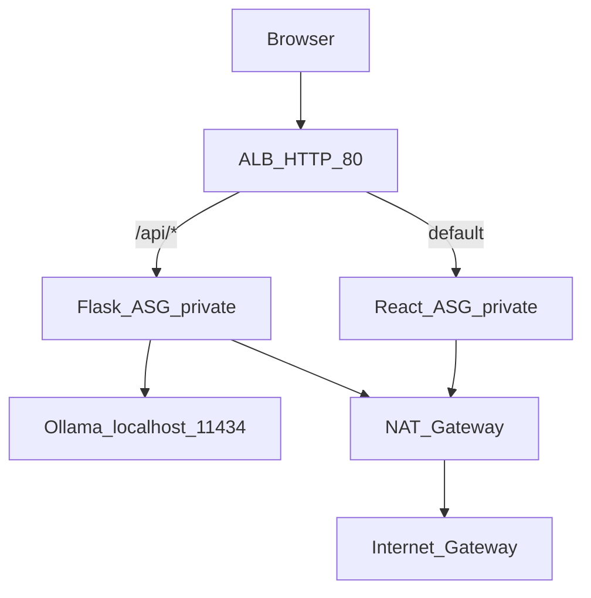

# Ollama Chat

A full-stack chat application that proxies [Ollama](https://ollama.com) through a Flask API and serves a React single-page application. The project includes production-style AWS deployment: multi-AZ VPC, Application Load Balancer path routing, Auto Scaling Groups in private subnets, and container images on GitHub Container Registry (GHCR).

**Repository:** [github.com/Bigessfour/ollama-chat](https://github.com/Bigessfour/ollama-chat)

---

## Overview and goals

Ollama Chat demonstrates how to build and operate a local-LLM web stack end to end:

- **Locally:** Run Ollama, a Flask API proxy, and a Vite/React dev server for rapid iteration.
- **In AWS:** Deploy containerized frontend and backend tiers behind an ALB, with Ollama co-located on backend instances (not exposed to the internet).

Primary learning outcomes for portfolio and Code Platoon review:

- Separation of UI, API, and inference layers
- Path-based ALB routing (`/api/*` vs static SPA)
- Private subnet application tier with controlled egress via NAT
- Secrets handling (GitHub PAT in SSM Parameter Store, not in user-data)

---

## Architecture



For VPC layout, security groups, NACLs, and data flows, see [docs/ARCHITECTURE.md](docs/ARCHITECTURE.md).

---

## Technology stack

| Layer | Technology |
|-------|------------|
| Frontend | React 19, Vite 8, nginx (production container) |
| Backend | Python 3.11, Flask 3, Gunicorn, flask-cors, requests |
| LLM runtime | Ollama (`gemma:2b`) |
| Containers | Docker multi-arch builds (`linux/amd64`, `linux/arm64`) |
| Registry | GitHub Container Registry (GHCR) |
| AWS | VPC, subnets, NAT, ALB, EC2 ASG, IAM, SSM Parameter Store |
| Deployment | Bash scripts (`infrastructure/*.sh`) |

---

## Repository structure

```
ollama-chat/
├── backend/           # Flask API proxy to Ollama (see backend/README.md)
├── frontend/          # React SPA (Vite)
├── infrastructure/    # AWS deploy scripts, EC2 user-data
├── docs/              # Architecture, deployment, submission checklist
└── requirements.txt   # Wrapper → backend/requirements.txt
```

After cloning, run all commands from the repository root:

```bash
git clone https://github.com/Bigessfour/ollama-chat.git
cd ollama-chat
```

---

## Prerequisites

| Requirement | Purpose |
|-------------|---------|
| [Ollama](https://ollama.com/download) | Local LLM runtime |
| Node.js 20+ and npm 10+ | Frontend dev server |
| Docker | Backend container; image builds for AWS |
| Python 3.11+ (optional) | Run Flask without Docker |
| AWS CLI v2 | Deploy and manage infrastructure |
| AWS account | EC2, VPC, ALB, IAM, SSM permissions |
| GitHub PAT | `read:packages` (EC2 pull), `write:packages` (image push) |

---

## Local development

### 1. Pull the Ollama model

The API uses model `gemma:2b` by default (override with `OLLAMA_MODEL` — see [backend/.env.example](backend/.env.example)):

```bash
ollama pull gemma:2b
```

### 2. Start the backend

**Docker (recommended on macOS — port 5002 avoids conflicts with AirPlay on 5000):**

```bash
docker build -t ollama-chat-backend ./backend
docker run -p 5002:5000 \
  -e OLLAMA_URL=http://host.docker.internal:11434 \
  ollama-chat-backend
```

**Or run the dev server directly (port 5000):**

```bash
cd backend
python3.11 -m venv .venv && source .venv/bin/activate
pip install -r requirements.txt
cp .env.example .env
python run.py
```

If using port 5000, change the proxy target in `frontend/vite.config.js` from `http://localhost:5002` to `http://localhost:5000`.

| Variable | Default | Description |
|----------|---------|-------------|
| `OLLAMA_URL` | `http://localhost:11434` | Ollama HTTP API base URL |
| `OLLAMA_MODEL` | `gemma:2b` | Model for chat and readiness checks |

Full backend configuration: [backend/README.md](backend/README.md).

### 3. Start the frontend

```bash
cd frontend
cp .env.example .env    # leave VITE_API_URL empty for dev proxy
npm install
npm run dev
```

Open http://localhost:5173. Requests to `/api/*` are proxied to the backend (default `http://localhost:5002`).

| Variable | Dev value | Description |
|----------|-----------|-------------|
| `VITE_API_URL` | *(empty)* | Empty uses same-origin paths + Vite proxy |

Frontend details: [frontend/README.md](frontend/README.md).

### 4. Verify the API

```bash
curl http://localhost:5002/api/health
curl http://localhost:5002/api/ready
curl -X POST http://localhost:5002/api/chat \
  -H 'Content-Type: application/json' \
  -d '{"message":"Hello"}'
```

Use port `5000` if running `python run.py` without Docker port mapping.

### Current implementation status

| Component | Status |
|-----------|--------|
| Backend `/api/health`, `/api/ready`, `/api/chat` | Implemented |
| Frontend chat UI | Implemented (TanStack Query + Zustand) |
| Connection handling / retries | Implemented |

---

## How to Demo

Use this section for Code Platoon review, portfolio interviews, or a quick technical walkthrough.

### Option A — Local (about 5 minutes, no AWS)

1. Pull the model: `ollama pull gemma:2b`
2. Start the backend (Docker on port 5002 recommended on macOS):

   ```bash
   docker build -t ollama-chat-backend ./backend
   docker run -p 5002:5000 -e OLLAMA_URL=http://host.docker.internal:11434 ollama-chat-backend
   ```

   Or use `python run.py` in `backend/` on port 5000 (adjust Vite proxy if needed).

3. Start the frontend:

   ```bash
   cd frontend && npm install && npm run dev
   ```

4. Open http://localhost:5173 — send a chat message in the UI.
5. Show API probes and chat in the terminal:

   ```bash
   curl -s http://localhost:5002/live | jq .
   curl -s http://localhost:5002/api/ready | jq .
   curl -s -X POST http://localhost:5002/api/chat \
     -H 'Content-Type: application/json' \
     -d '{"message":"Hello"}' | jq .
   ```

### Option B — AWS (deployed stack)

1. Open `http://<ALB_DNS>/` in a browser and send a chat message.
2. From your workstation:

   ```bash
   export ALB_DNS=<your-alb-dns-name>
   curl -s "http://${ALB_DNS}/live" | jq .
   curl -s "http://${ALB_DNS}/api/ready" | jq .
   curl -s -X POST "http://${ALB_DNS}/api/chat" \
     -H 'Content-Type: application/json' \
     -d '{"message":"Hello"}' | jq .
   ```

3. (Optional) In CloudWatch Logs, open `/ollama-chat/flask/app` and show a JSON `request_completed` line. See [docs/OPERATIONS.md](docs/OPERATIONS.md).

Full deploy steps: [docs/DEPLOYMENT.md](docs/DEPLOYMENT.md). Screenshot list: [docs/SCREENSHOTS.md](docs/SCREENSHOTS.md).

### What to highlight for reviewers

- **ALB path routing** — `/api/*` to Flask, default to React SPA
- **Private subnets** — app tier has no direct internet inbound; Ollama on `127.0.0.1` only
- **Secrets** — GHCR PAT in SSM, not in user-data or git ([docs/SECRETS.md](docs/SECRETS.md))
- **Observability** — structured JSON logs, EMF metrics, `/live` vs `/ready`, CloudWatch alarms ([docs/OPERATIONS.md](docs/OPERATIONS.md))

Submission evidence map: [docs/SUBMISSION.md](docs/SUBMISSION.md).

---

## Deployment overview

Full procedures: [docs/DEPLOYMENT.md](docs/DEPLOYMENT.md).

| Step | Action | Script |
|------|--------|--------|
| 1 | Build and push backend image to GHCR | `./infrastructure/push-backend.sh` |
| 2 | Deploy AWS stack (VPC, ALB, ASGs) | [Terraform](infrastructure/terraform/README.md) (recommended), `./infrastructure/deploy-aws.sh`, or Console |
| 3 | Note ALB DNS; build frontend with API URL | `export ALB_DNS=<alb-hostname>` then `./infrastructure/push-frontend.sh` |
| 4 | Roll out user-data or image updates | `./infrastructure/update-phase4.sh` |

**Important:** Do not run `deploy-aws.sh` twice in the same account/region without teardown — it creates a new stack each time. For production-like hardening (split IAM roles, optional API key in SSM), use [Terraform](infrastructure/terraform/README.md). See [SECURITY.md](SECURITY.md) for the full checklist.

Default region: `us-east-1` (override with `AWS_REGION`).

---

## Cost considerations

Approximate monthly cost drivers at minimum capacity (2× Flask `t3.large` + 2× React `t3.small`, `us-east-1`):

| Resource | Rough cost | Notes |
|----------|------------|-------|
| EC2 instances | Highest line item | 4 instances at min desired capacity |
| NAT Gateway | ~$32/month + data | Single NAT in one AZ |
| Application Load Balancer | ~$16–22/month + LCU | Hourly + usage |
| Elastic IP | Low | Associated with NAT |
| Data transfer | Variable | GHCR pulls, Ollama install, model download |

Ollama model pulls and inference add CPU and egress through the NAT gateway. Scale down or tear down resources when not actively demoing.

---

## Cleanup instructions

There is no automated teardown script. Delete resources in **reverse dependency order** to avoid orphaned charges:

1. Set both ASGs (`ollama-chat-flask-asg`, `ollama-chat-react-asg`) desired capacity to **0**; wait for instances to terminate.
2. Delete Auto Scaling groups, then launch templates (`ollama-chat-flask-lt`, `ollama-chat-react-lt`).
3. Delete ALB listener rules, listener, target groups, then the ALB (`ollama-chat-alb`).
4. Delete the NAT gateway; release the Elastic IP.
5. Detach and delete the Internet Gateway; delete subnets, route tables, and the VPC (`ollama-chat-vpc`).
6. Delete security groups (`ollama-chat-alb-sg`, `ollama-chat-react-sg`, `ollama-chat-flask-sg`).
7. Remove IAM instance profiles and roles — Terraform: `ollama-chat-flask-ec2-role`, `ollama-chat-react-ec2-role` (and profiles); legacy bash: `ollama-chat-ec2-ssm-role`. Delete SSM parameters `/ollama-chat/ghcr-pat` and `/ollama-chat/api-key` (if created).
8. Optionally delete GHCR images and local `.aws-deploy-state`.

Console navigation hints: [docs/DEPLOYMENT.md#teardown](docs/DEPLOYMENT.md#teardown).

---

## Security notes

See **[SECURITY.md](SECURITY.md)** for the threat model, hardening checklist, secrets handling, and deploy-path comparison.

| Control | Implementation |
|---------|----------------|
| Ollama isolation | `127.0.0.1:11434`; no SG rule; private NACL **deny** on 11434 |
| App tier network | Private subnets; Flask :5000 and React :80 **only** from ALB security group |
| Private NACLs | Allow 80/5000 from public subnet CIDRs; ephemeral within VPC; deny 11434 |
| Registry credentials | SSM `/ollama-chat/ghcr-pat`; tier-scoped `ssm:GetParameter` (Terraform split roles) |
| API protection | Optional `/ollama-chat/api-key` via `TF_VAR_api_key`; `X-API-Key` with `compare_digest` |
| Flask hardening | CSP/HSTS (behind HTTPS), production CORS validation, rate limits, optional `REQUIRE_API_KEY_IN_PRODUCTION` |
| EC2 metadata | IMDSv2 required on launch templates |
| User-data | Idempotent; secrets from SSM only; Docker `--cap-drop=ALL` |
| Management | SSM Session Manager; `enable_ssh_between_tiers` default **false** (Terraform) |

**Remaining gaps:** HTTP-only ALB (no TLS/WAF by default), in-memory rate limits at scale. Legacy `deploy-aws.sh` still uses a single shared EC2 IAM role.

Details: [docs/ARCHITECTURE.md#security-controls](docs/ARCHITECTURE.md#security-controls).

---

## Documentation

| Document | Description |
|----------|-------------|
| [backend/README.md](backend/README.md) | API structure, configuration, tests, Docker |
| [frontend/README.md](frontend/README.md) | Chat UI, env vars, Docker (unprivileged nginx) |
| [docs/ARCHITECTURE.md](docs/ARCHITECTURE.md) | VPC topology, components, network flows, scalability |
| [infrastructure/terraform/README.md](infrastructure/terraform/README.md) | Terraform IaC (recommended deploy path) |
| [docs/DEPLOYMENT.md](docs/DEPLOYMENT.md) | CLI, Console, and Terraform deployment runbooks |
| [SECURITY.md](SECURITY.md) | Threat model, secrets, hardening checklist |
| [docs/SUBMISSION.md](docs/SUBMISSION.md) | Code Platoon / portfolio submission (requirement → evidence) |
| [docs/SCREENSHOTS.md](docs/SCREENSHOTS.md) | Screenshot capture guide |
| [docs/OPERATIONS.md](docs/OPERATIONS.md) | Logs, metrics, alarms, incident response |
| [docs/SECRETS.md](docs/SECRETS.md) | Secrets and env var reference |
| [CHANGELOG.md](CHANGELOG.md) | Release history |
| [CONTRIBUTING.md](CONTRIBUTING.md) | Contributing guidelines |

---

## License

MIT License — see [LICENSE](LICENSE). Intended for educational and portfolio use.
