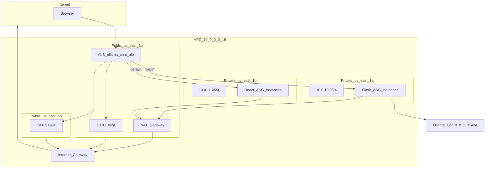
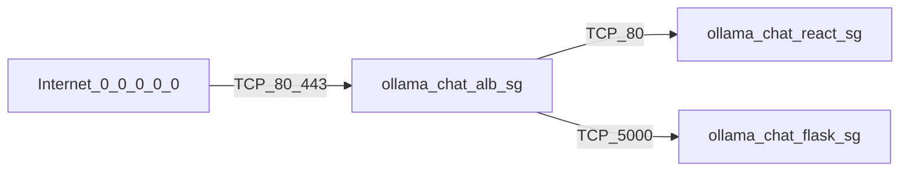
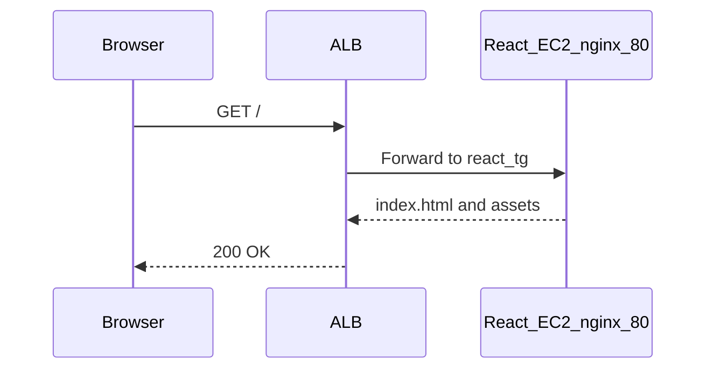
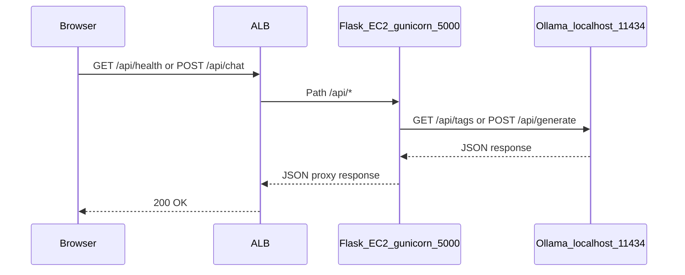
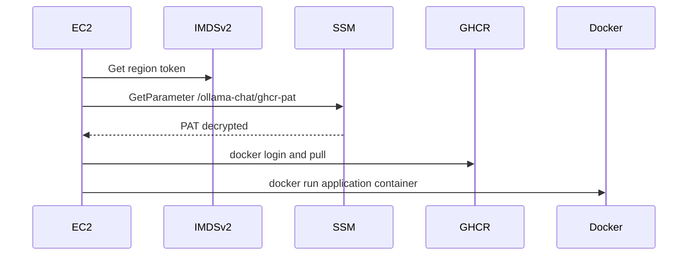
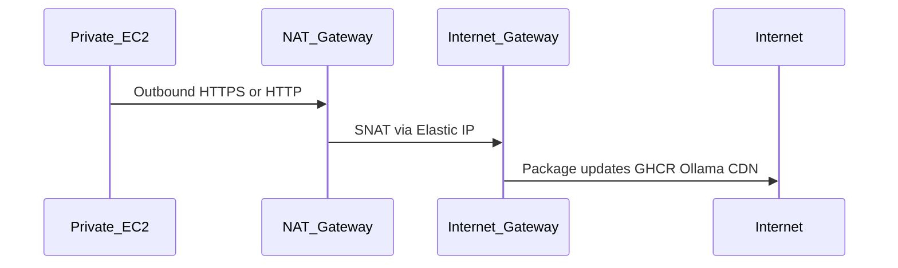

# Architecture

Technical architecture for the Ollama Chat AWS deployment and application stack. Deployment procedures live in [DEPLOYMENT.md](DEPLOYMENT.md). The repository entry point is [README.md](../README.md).

---

## System context

Ollama Chat separates concerns into three runtime layers:

1. **Presentation** — React SPA served by nginx on the React Auto Scaling Group.
2. **API** — Flask/Gunicorn proxy on the Flask Auto Scaling Group; validates requests and forwards to Ollama.
3. **Inference** — Ollama on the same host as the Flask container (`localhost:11434`); never exposed to the public internet.

**Trust boundaries:**

| Zone | Components | Exposure |
|------|------------|----------|
| Internet | Browser clients | Public |
| DMZ (public subnets) | ALB, NAT Gateway | ALB accepts 80/443 from `0.0.0.0/0` |
| Application (private subnets) | React + Flask EC2 | No direct inbound from internet |
| Instance localhost | Ollama | Loopback only |

---

## AWS network topology

### Addressing and routing

| Resource | CIDR / AZ | Role |
|----------|-----------|------|
| VPC | `10.0.0.0/16` | Isolated network |
| Public subnet 1a | `10.0.1.0/24`, `${REGION}a` | ALB, NAT Gateway |
| Public subnet 1b | `10.0.2.0/24`, `${REGION}b` | ALB (multi-AZ) |
| Private subnet 1a | `10.0.10.0/24`, `${REGION}a` | Flask ASG |
| Private subnet 1b | `10.0.11.0/24`, `${REGION}b` | React ASG |
| Public route table | `0.0.0.0/0` → IGW | Internet egress for public subnets |
| Private route table | `0.0.0.0/0` → NAT | Outbound internet for private instances |

DNS hostnames and DNS resolution are enabled on the VPC.

### Application Load Balancer

| Setting | Value |
|---------|-------|
| Name | `ollama-chat-alb` |
| Scheme | Internet-facing |
| Subnets | Both public subnets |
| Listener | HTTP **port 80** (HTTPS not configured) |

| Priority | Condition | Target group | Port | Health check |
|----------|-----------|--------------|------|--------------|
| 1 | Path `/api/*` | `ollama-chat-flask-tg` | 5000 | `GET /api/ready` |
| default | All other paths | `ollama-chat-react-tg` | 80 | `GET /` |

Path-based routing provides a single public hostname for the SPA and API. The frontend Docker image is built with `VITE_API_URL=http://<ALB_DNS>` so browser requests use the same origin through the ALB. The nginx container listens on port **8080** (unprivileged); EC2 maps host port 80 to container 8080.

### Security groups

| Security group | Inbound | Purpose |
|----------------|---------|---------|
| `ollama-chat-alb-sg` | TCP 80, 443 from `0.0.0.0/0` | Public ALB |
| `ollama-chat-react-sg` | TCP 80 from `ollama-chat-alb-sg` | nginx only from ALB |
| `ollama-chat-flask-sg` | TCP 5000 from `ollama-chat-alb-sg` | Gunicorn from ALB |
| `ollama-chat-flask-sg` | TCP 22 from `ollama-chat-react-sg` | **Optional** — only when `enable_ssh_between_tiers = true` (Terraform default: **false**) |

Port **11434** (Ollama) is intentionally absent from all security groups.

### Network ACLs (private subnets)

**Terraform** (`modules/networking`) and **`deploy-aws.sh`** both attach a custom NACL (`ollama-chat-private-nacl`) to private subnets. Console-only deploys without these scripts must replicate the rules below or targets may stay unhealthy.

| Rule # | Direction | Action | Ports | CIDR | Purpose |
|--------|-----------|--------|-------|------|---------|
| 50 | Inbound | **Deny** | TCP 11434 | `0.0.0.0/0` | Defense in depth — Ollama binds `127.0.0.1` only |
| 100–103 | Inbound | Allow | TCP 80, 5000 | Public subnet CIDRs (`10.0.1.0/24`, `10.0.2.0/24`) | ALB health checks and forwarded traffic |
| 110 | Inbound | Allow | TCP 1024–65535 | VPC CIDR (`10.0.0.0/16`) | Ephemeral return traffic within the VPC |
| 100 | Outbound | Allow | All | `0.0.0.0/0` | NAT egress (GHCR, package repos, Ollama CDN) |

Misconfigured NACLs are a common cause of unhealthy target groups when rules diverge from the table above.

---

## Component descriptions

| Component | Name / type | Details |
|-----------|-------------|---------|
| ALB | `ollama-chat-alb` | Layer 7 load balancer in public subnets |
| Flask target group | `ollama-chat-flask-tg` | HTTP:5000, health `/api/ready` |
| React target group | `ollama-chat-react-tg` | HTTP:80, health `/` |
| Flask launch template | `ollama-chat-flask-lt` | `t3.large`, Amazon Linux 2023 |
| React launch template | `ollama-chat-react-lt` | `t3.small`, Amazon Linux 2023 |
| Flask ASG | `ollama-chat-flask-asg` | Min 2, max 4, desired 2; private subnets; ELB health check; grace **600s** |
| React ASG | `ollama-chat-react-asg` | Min 2, max 4, desired 2; private subnets; ELB health check; grace **300s** |
| IAM (Terraform) | `ollama-chat-flask-ec2-role` / `ollama-chat-react-ec2-role` | Separate roles and instance profiles per tier; `ssm:GetParameter` scoped per parameter |
| IAM (legacy bash) | `ollama-chat-ec2-ssm-role` | Single shared role used by `deploy-aws.sh` for both tiers |
| SSM parameters | `/ollama-chat/ghcr-pat`, `/ollama-chat/api-key` (optional) | SecureString — GHCR PAT; API key when `TF_VAR_api_key` is set |
| Launch templates | `ollama-chat-flask-lt`, `ollama-chat-react-lt` | **IMDSv2 required** (`HttpTokens: required`) |
| Backend image | `ghcr.io/bigessfour/ollama-chat-backend:latest` | Flask + Gunicorn |
| Frontend image | `ghcr.io/bigessfour/ollama-chat-frontend:latest` | Vite build + nginx |

### Flask instance bootstrap

Source: `infrastructure/user-data/flask.sh` (idempotent; no secrets in the script file)

1. On first boot: install Docker and AWS CLI; install Ollama with `OLLAMA_HOST=127.0.0.1` systemd override.
2. Background `ollama pull gemma:2b` (deferred so the API container starts sooner).
3. Fetch GHCR PAT (and optional API key) from SSM via IMDSv2 token; `set +x` during `docker login`.
4. Pull backend image; run container with bridge networking (`-p 5000:5000`, `host.docker.internal` for Ollama), `--cap-drop=ALL`, `no-new-privileges`.
5. On re-boot: marker file `/var/lib/ollama-chat/flask-bootstrapped` — restart existing container only.

Logs: `/var/log/ollama-chat-flask.log`, `/var/log/ollama-pull.log`.

### React instance bootstrap

Source: `infrastructure/user-data/react.sh` (idempotent; PAT from SSM only)

1. On first boot: install Docker and AWS CLI; fetch PAT from SSM; `docker login` and pull frontend image.
2. Run nginx with host port 80 → container 8080; `--cap-drop=ALL`, `no-new-privileges`.
3. On re-boot: marker `/var/lib/ollama-chat/react-bootstrapped` — restart existing container.

Logs: `/var/log/ollama-chat-react.log`.

---

## Network flow diagrams

### SPA page load

### API health and chat

### Instance bootstrap and image pull

### Private subnet egress

---

## Security controls

| Layer | Control | Notes |
|-------|---------|-------|
| Network segmentation | Public vs private subnets | Only ALB and NAT in public tier; app instances have no public IP |
| Security groups | Least-privilege between tiers | ALB is sole ingress path to app ports (Flask :5000 from ALB SG only) |
| Private NACLs | Allow 80/5000 from public CIDRs; ephemeral in VPC CIDR; **deny 11434** | Terraform `modules/networking` and `deploy-aws.sh` |
| Ollama | `OLLAMA_HOST=127.0.0.1` | Not in security groups; NACL deny on 11434 |
| Secrets | SSM SecureString only | `/ollama-chat/ghcr-pat`; optional `/ollama-chat/api-key` — never in user-data files |
| IAM (Terraform) | Split roles per tier | `ollama-chat-flask-ec2-role` (+ api-key param when set); `ollama-chat-react-ec2-role` (PAT only); `ssm:GetParameter` single-ARN scope |
| IAM (bash deploy) | Legacy shared role | `ollama-chat-ec2-ssm-role` for both tiers — prefer Terraform for least privilege |
| Management | SSM Session Manager | `enable_ssh_between_tiers` default **false** (no Flask :22 from React) |
| Metadata | IMDSv2 required | Launch templates set `HttpTokens: required`; user-data uses token-based IMDS |
| Flask | Headers, `compare_digest` API key, CORS guardrails | CSP, HSTS when `X-Forwarded-Proto: https`; `APP_ENV=production`; optional `REQUIRE_API_KEY_IN_PRODUCTION` |
| User-data | Idempotent bootstrap | Marker files under `/var/lib/ollama-chat/`; re-boot restarts containers |
| Containers | Bridge network, capability drop | `-p 5000:5000`, `--cap-drop=ALL`, `no-new-privileges`; non-root images |

See [SECURITY.md](../SECURITY.md) for the threat model, operator checklist, and CI/CD secret handling.

### Known weaknesses

| Issue | Risk | Mitigation (future) |
|-------|------|---------------------|
| HTTP-only ALB | Traffic not encrypted in transit | ACM certificate + HTTPS listener (enables HSTS from Flask) |
| No API auth (default) | Anyone with ALB URL can use `/api/chat` | `TF_VAR_api_key` → SSM + `X-API-Key` header |
| No WAF | Common web attacks unfiltered | AWS WAF on ALB |
| In-memory rate limits | Per-worker buckets behind ALB | Redis backend for Flask-Limiter |
| Single NAT | AZ failure affects private egress | Second NAT in other AZ (cost tradeoff) |
| Legacy bash IAM | Shared EC2 role for both tiers | Migrate to Terraform split roles |

---

## Scalability and failure considerations

### Auto Scaling

| ASG | Min | Desired | Max | Health check |
|-----|-----|---------|-----|--------------|
| `ollama-chat-flask-asg` | 2 | 2 | 4 | ELB, grace 600s |
| `ollama-chat-react-asg` | 2 | 2 | 4 | ELB, grace 300s |

The deploy scripts do **not** define CPU or request-count scaling policies. Capacity changes require manual ASG updates or future Terraform/ASG policy work.

### Failure modes

| Scenario | Behavior |
|----------|----------|
| Single Flask instance unhealthy | ALB routes to healthy targets; ASG replaces failed instance |
| Ollama model still pulling | `/api/ready` returns 503 until `gemma:2b` is available; `/api/health` stays 200 |
| NAT Gateway AZ outage | Private instances in all AZs lose outbound internet if only one NAT exists |
| ALB AZ impairment | Remaining healthy targets in other AZ continue serving |
| Stale launch template | Run `update-phase4.sh` for instance refresh with new user-data |

### Rolling updates

`infrastructure/update-phase4.sh` creates new launch template versions from current user-data files, updates ASG settings, and starts **instance refresh** with 50% minimum healthy capacity.

### Multi-AZ

Subnets span `${REGION}a` and `${REGION}b`. The ALB is cross-zone; target groups register instances in both private subnets.

---

## Application architecture

### Backend (`backend/`)

| Route | Method | Upstream | Response |
|-------|--------|----------|----------|
| `/live`, `/health`, `/api/health` | GET | — | Liveness: `{ status, service, version, uptime_seconds }` |
| `/ready`, `/api/ready` | GET | `GET {OLLAMA_URL}/api/tags` | Readiness: `checks.ollama` or 503 |
| `/api/chat` | POST | `POST {OLLAMA_URL}/api/generate` | `{ response, model }` (non-streaming) |

Environment:

- `OLLAMA_URL` — default `http://localhost:11434`
- `MODEL` — constant `gemma:2b`

Production serves via Gunicorn on `0.0.0.0:5000` inside the container; EC2 publishes host port 5000 with bridge networking (`-p 5000:5000`).

### Frontend

| Mode | API base URL |
|------|----------------|
| Local dev | Empty `VITE_API_URL` → Vite proxies `/api` to backend |
| Production image | `VITE_API_URL=http://<ALB_DNS>` baked at `docker build` time |

Client helpers: `frontend/src/api/client.js` (`getHealth`, `sendChatMessage`).

---

## Observability

Structured JSON logs, EMF application metrics, CloudWatch Agent on EC2, log groups, and alarms are described in [OPERATIONS.md](OPERATIONS.md). Terraform module: `infrastructure/terraform/modules/observability`.

---

## Future improvements

- HTTPS listener with ACM certificate on the ALB
- HTTPS (ACM), CPU scaling policies (Terraform modules exist; extend as needed — see [infrastructure/terraform/README.md](../infrastructure/terraform/README.md))
- AWS WAF managed rule sets
- Restrict CORS to the ALB hostname
- Optional streaming chat via Ollama SSE
- ECR instead of GHCR for tighter AWS IAM integration
- Second NAT Gateway for high availability
---

## Related documentation

- [SECURITY.md](../SECURITY.md) — Threat model, secrets, hardening checklist
- [DEPLOYMENT.md](DEPLOYMENT.md) — Step-by-step deploy, verify, teardown
- [OPERATIONS.md](OPERATIONS.md) — Logs, metrics, alarms, incident response
- [README.md](../README.md) — Quick start and cost summary
- [infrastructure/terraform/README.md](../infrastructure/terraform/README.md) — Terraform IAM, variables, migration
- [SUBMISSION.md](SUBMISSION.md) — Code Platoon / portfolio submission (requirement → evidence)
- [SCREENSHOTS.md](SCREENSHOTS.md) — Screenshot capture guide
- [SECRETS.md](SECRETS.md) — Secrets reference
