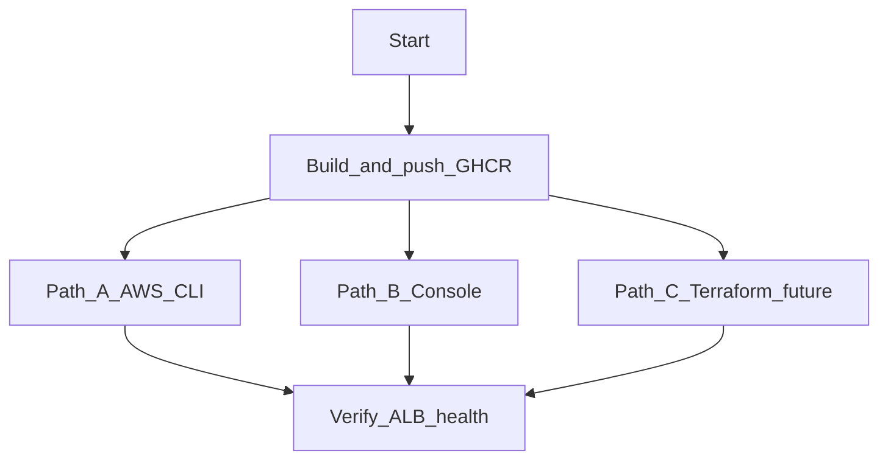

# Deployment Guide

Step-by-step instructions to build container images, deploy AWS infrastructure, verify the stack, and tear it down. Architecture details: [ARCHITECTURE.md](ARCHITECTURE.md). Quick reference: [README.md](../README.md).

---

## Overview



| Path | When to use |
|------|-------------|
| **A — AWS CLI** | Legacy one-shot deploy; `infrastructure/deploy-aws.sh` (not idempotent) |
| **B — Console** | Learning AWS UI; matches script-created resources |
| **C — Terraform** | **Recommended** — production-like IaC; split IAM, optional API key in SSM |

**Recommended order:** Push backend image → deploy infrastructure (**Path C** preferred, or Path A/B) → note ALB DNS → push frontend image with `ALB_DNS` → verify health → optional Phase 4 rollout.

Security posture and path comparison: [SECURITY.md](../SECURITY.md).

---

## Prerequisites checklist

- [ ] AWS CLI v2 installed and configured (`aws sts get-caller-identity` succeeds)
- [ ] Docker with `buildx` for multi-platform builds
- [ ] GitHub Personal Access Token (classic or fine-grained) with:
  - `write:packages` — push images from your workstation
  - `read:packages` — EC2 instances pull images at boot
- [ ] Permission to create VPC, EC2, ELB, IAM, SSM in target account
- [ ] Backend and frontend Dockerfiles committed in the repository
- [ ] Default region: `us-east-1` (override with `export AWS_REGION=<region>`)

Forks: update GHCR image names and `docker login` username in `infrastructure/push-*.sh` and user-data scripts if not using `ghcr.io/bigessfour/...`.

---

## Phase 0 — Container images

### 0.1 Authenticate to GHCR

```bash
export GHCR_PAT=<your_github_pat>
echo "$GHCR_PAT" | docker login ghcr.io -u <github_username> --password-stdin
```

### 0.2 Push backend image

From the repository root:

```bash
./infrastructure/push-backend.sh
```

This builds and pushes:

`ghcr.io/bigessfour/ollama-chat-backend:latest`  
(platforms: `linux/amd64`, `linux/arm64`)

### 0.3 Push frontend image (after ALB exists)

The frontend bake requires the ALB hostname **without** `http://` or a trailing slash:

```bash
export ALB_DNS=<your-alb-dns-name>   # e.g. ollama-chat-alb-123456789.us-east-1.elb.amazonaws.com
./infrastructure/push-frontend.sh
```

Image: `ghcr.io/bigessfour/ollama-chat-frontend:latest` with `VITE_API_URL=http://${ALB_DNS}`.

If deploying for the first time, complete Phase 1 or Phase 2 below to obtain `ALB_DNS`, then return to this step.

---

## Phase 1 — Path A: Automated deploy (`deploy-aws.sh`)

### 1.1 Set environment variables

```bash
export AWS_REGION=us-east-1          # optional; default us-east-1
export GHCR_PAT=<pat_with_read_packages>
```

### 1.2 Run the deploy script

```bash
./infrastructure/deploy-aws.sh
```

The script creates:

- VPC `10.0.0.0/16`, public and private subnets, IGW, single NAT Gateway
- Private subnet NACL `ollama-chat-private-nacl` (allow 80/5000 from public CIDRs; deny 11434)
- Security groups for ALB, React, and Flask tiers (no SSH between tiers)
- Legacy IAM role `ollama-chat-ec2-ssm-role` and SSM parameter `/ollama-chat/ghcr-pat`
- ALB, target groups, HTTP listener with `/api/*` rule
- Launch templates (IMDSv2 required) and Auto Scaling groups (min 2, max 4, desired 2 each)

State is written to `infrastructure/.aws-deploy-state` (gitignored):

```
REGION=us-east-1
VPC_ID=<vpc-id>
ALB_DNS=<alb-hostname>
ALB_ARN=<alb-arn>
FLASK_TG=<target-group-arn>
REACT_TG=<target-group-arn>
```

### 1.3 Post-deploy: frontend image and instance refresh

```bash
export ALB_DNS=<value_from_script_output_or_state_file>
./infrastructure/push-frontend.sh
```

Trigger instance refresh on both ASGs (Console: EC2 → Auto Scaling Groups → Instance refresh), or wait for new instances to pull `:latest` on replacement.

### 1.4 Limitations of Path A

| Item | Behavior |
|------|----------|
| Idempotency | **Not** idempotent — re-run creates duplicate stacks |
| IAM | Single shared role `ollama-chat-ec2-ssm-role` (legacy; Terraform uses split tier roles) |
| API key in SSM | Not created by script — use Terraform `TF_VAR_api_key` for `/ollama-chat/api-key` |
| SSH between tiers | Not configured (matches Terraform default) |
| Private NACLs | Created (`ollama-chat-private-nacl`, deny 11434) — mirrors Terraform |
| HTTPS | Not configured (HTTP :80 only) |
| Frontend timing | Push frontend **after** you have `ALB_DNS` |

Prefer [Path C — Terraform](#path-c--terraform-recommended) for production-like environments. See [SECURITY.md](../SECURITY.md).

---

## Phase 2 — Path B: AWS Console

Use this path to mirror what `deploy-aws.sh` automates. Resource names match the scripts for consistency.

### 2.1 VPC and networking

**VPC → Create VPC → VPC and more**

| Setting | Value |
|---------|-------|
| Name | `ollama-chat-vpc` |
| IPv4 CIDR | `10.0.0.0/16` |
| Availability Zones | 2 |
| Public / private subnets | 2 each |
| NAT gateways | 1 |
| DNS hostnames | Enable |
| DNS resolution | Enable |

| Subnet | AZ | CIDR | Type |
|--------|-----|------|------|
| Public-1a | `<region>a` | `10.0.1.0/24` | Public |
| Public-1b | `<region>b` | `10.0.2.0/24` | Public |
| Private-1a | `<region>a` | `10.0.10.0/24` | Private |
| Private-1b | `<region>b` | `10.0.11.0/24` | Private |

**Internet Gateway:** Create, attach to VPC, add route `0.0.0.0/0` → IGW on the public route table, associate public subnets.

**NAT Gateway:** Allocate Elastic IP → create NAT in Public-1a → private route table `0.0.0.0/0` → NAT → associate private subnets.

### 2.2 Network ACLs (private subnets)

Terraform and `deploy-aws.sh` attach `ollama-chat-private-nacl` automatically. For Console-only deploys, replicate the rules in [ARCHITECTURE.md — Network ACLs](ARCHITECTURE.md#network-acls-private-subnets).

| Rule # | Direction | Action | Ports | CIDR |
|--------|-----------|--------|-------|------|
| 50 | Inbound | **Deny** | TCP 11434 | `0.0.0.0/0` |
| 100–103 | Inbound | Allow | TCP 80, 5000 | `10.0.1.0/24`, `10.0.2.0/24` |
| 110 | Inbound | Allow | TCP 1024–65535 | `10.0.0.0/16` (VPC CIDR) |
| 100 | Outbound | Allow | All | `0.0.0.0/0` |

### 2.3 Security groups

Create in the VPC:

| Name | Inbound |
|------|---------|
| `ollama-chat-alb-sg` | TCP 80, 443 from `0.0.0.0/0` |
| `ollama-chat-react-sg` | TCP 80 from `ollama-chat-alb-sg` |
| `ollama-chat-flask-sg` | TCP 5000 from `ollama-chat-alb-sg`; TCP 22 from `ollama-chat-react-sg` when `enable_ssh_between_tiers = true` (default **true**) |

### 2.4 IAM and SSM

**Terraform (recommended)** creates separate roles and instance profiles:

| Resource | Purpose |
|----------|---------|
| `ollama-chat-flask-ec2-role` / `ollama-chat-flask-ec2-profile` | Flask ASG — PAT + optional API key parameter |
| `ollama-chat-react-ec2-role` / `ollama-chat-react-ec2-profile` | React ASG — PAT only |

**Legacy (`deploy-aws.sh` / Console Path B):** single role `ollama-chat-ec2-ssm-role` and profile of the same name for both launch templates.

Inline policy pattern (single `ssm:GetParameter` per ARN — no `GetParameters`):

```json
{
  "Version": "2012-10-17",
  "Statement": [{
    "Effect": "Allow",
    "Action": ["ssm:GetParameter"],
    "Resource": "arn:aws:ssm:<REGION>:<ACCOUNT_ID>:parameter/ollama-chat/ghcr-pat"
  }]
}
```

Flask role adds a second statement for `parameter/ollama-chat/api-key` when using Terraform with `api_key` set.

**SSM parameters:**

| Parameter | Type | Created by |
|-----------|------|------------|
| `/ollama-chat/ghcr-pat` | SecureString | Terraform (`TF_VAR_ghcr_pat`), `deploy-aws.sh`, or CLI |
| `/ollama-chat/api-key` | SecureString | Terraform when `TF_VAR_api_key` or `api_key` in tfvars is set |

```bash
export TF_VAR_ghcr_pat="$GHCR_PAT"
export TF_VAR_api_key='your-random-api-key'   # optional — chat protection

aws ssm put-parameter \
  --name /ollama-chat/ghcr-pat \
  --type SecureString \
  --value "$GHCR_PAT" \
  --overwrite \
  --region <REGION>
```

See [SECURITY.md](../SECURITY.md) for rotation and CI/CD patterns.

### 2.5 Application Load Balancer

**Target groups**

| Name | Protocol | Port | VPC | Health check |
|------|----------|------|-----|--------------|
| `ollama-chat-flask-tg` | HTTP | 5000 | Your VPC | Path `/api/ready`, matcher 200 |
| `ollama-chat-react-tg` | HTTP | 80 | Your VPC | Path `/`, matcher 200 |

**Load balancer**

| Setting | Value |
|---------|-------|
| Name | `ollama-chat-alb` |
| Scheme | Internet-facing |
| IP address type | IPv4 |
| Subnets | Both public subnets |
| Security group | `ollama-chat-alb-sg` |

**Listener (HTTP :80)**

| Priority | Condition | Action |
|----------|-----------|--------|
| 1 | Path pattern `/api/*` | Forward to `ollama-chat-flask-tg` |
| default | — | Forward to `ollama-chat-react-tg` |

Record the ALB DNS name for Phase 0.3.

### 2.6 Launch templates

Use latest Amazon Linux 2023 x86_64 AMI (SSM parameter `/aws/service/ami-amazon-linux-latest/al2023-ami-kernel-default-x86_64`).

| Template | Instance type | Security groups | User data |
|----------|---------------|-----------------|-----------|
| `ollama-chat-flask-lt` | `t3.large` | `ollama-chat-flask-sg` | Contents of `infrastructure/user-data/flask.sh` (base64) |
| `ollama-chat-react-lt` | `t3.small` | `ollama-chat-react-sg` | Contents of `infrastructure/user-data/react.sh` (base64) |

| Template | IAM instance profile |
|----------|----------------------|
| `ollama-chat-flask-lt` | `ollama-chat-flask-ec2-profile` (Terraform) or `ollama-chat-ec2-ssm-role` (legacy bash) |
| `ollama-chat-react-lt` | `ollama-chat-react-ec2-profile` (Terraform) or `ollama-chat-ec2-ssm-role` (legacy bash) |

Both templates: **IMDSv2 required** (`HttpTokens: required` on metadata options).

### 2.7 Auto Scaling groups

| ASG | Launch template | Subnets | Capacity | Target group | Health check grace |
|-----|-----------------|---------|----------|--------------|-------------------|
| `ollama-chat-flask-asg` | `ollama-chat-flask-lt` | Private 1a, 1b | Min 2, desired 2, max 4 | `ollama-chat-flask-tg` | **600** seconds |
| `ollama-chat-react-asg` | `ollama-chat-react-lt` | Private 1a, 1b | Min 2, desired 2, max 4 | `ollama-chat-react-tg` | **300** seconds |

Enable **ELB** health checks (not EC2 status checks only).

---

## Phase 3 — Updates and rollouts

### 3.1 Rotate GHCR PAT in SSM

```bash
aws ssm put-parameter \
  --name /ollama-chat/ghcr-pat \
  --type SecureString \
  --value "$GHCR_PAT" \
  --overwrite \
  --region <REGION>
```

### 3.2 Push new images

```bash
./infrastructure/push-backend.sh
export ALB_DNS=<your-alb-dns>
./infrastructure/push-frontend.sh
```

### 3.3 Phase 4 automated rollout

When infrastructure already exists and user-data scripts changed:

```bash
./infrastructure/update-phase4.sh
```

This script:

1. Reads `infrastructure/.aws-deploy-state` if present
2. Creates new launch template versions with updated user-data from `flask.sh` / `react.sh`
3. Updates ASG health check grace (Flask 600s, React 300s)
4. Starts instance refresh on both ASGs (50% min healthy)

Use after fixing IMDSv2 PAT retrieval, `--network host` for Flask, or deferred Ollama model pull.

---

## Phase 4 — Verification

### 4.1 Target group health

**EC2 → Target Groups** — all targets for `ollama-chat-flask-tg` and `ollama-chat-react-tg` should be **healthy**.

Allow up to 10 minutes after launch for Flask instances (Ollama install + model pull).

### 4.2 HTTP checks

```bash
export ALB_DNS=<your-alb-dns>

curl -s "http://${ALB_DNS}/api/health" | jq .
curl -s "http://${ALB_DNS}/api/ready" | jq .
curl -s -X POST "http://${ALB_DNS}/api/chat" \
  -H 'Content-Type: application/json' \
  -d '{"message":"hello"}' | jq .
```

When `/ollama-chat/api-key` is configured, include the header on chat requests:

```bash
curl -s -X POST "http://${ALB_DNS}/api/chat" \
  -H 'Content-Type: application/json' \
  -H 'X-API-Key: <your-api-key>' \
  -d '{"message":"hello"}' | jq .
```

Expected health response includes `"status": "healthy"` and `"model": "gemma:2b"`. Without a valid `X-API-Key`, chat should return **401** when the API key parameter is set.

### 4.3 Instance logs (SSM Session Manager or serial console)

On a Flask instance:

```bash
sudo tail -f /var/log/user-data.log
sudo tail -f /var/log/ollama-pull.log
docker ps
curl -s http://localhost:5000/api/health
```

Chat may return errors until `ollama pull gemma:2b` completes in the background.

### 4.4 Browser

Open `http://<ALB_DNS>/` — React SPA loads. API calls go to `http://<ALB_DNS>/api/...` (baked into the frontend image at build time).

---

## Path C — Terraform (recommended)

Production-grade IaC lives in [infrastructure/terraform/README.md](../infrastructure/terraform/README.md).

**Secrets:** Never commit `GHCR_PAT` or `terraform.tfvars`. See [SECURITY.md](../SECURITY.md) for SSM Parameter Store and GitHub Actions guidance. `deploy-aws.sh` **exits** if `GHCR_PAT` is unset.

### Quick start

```bash
cd infrastructure/terraform/environments/dev
cp terraform.tfvars.example terraform.tfvars
export TF_VAR_ghcr_pat='your_github_pat'
export TF_VAR_api_key='your-random-api-key'   # optional — creates /ollama-chat/api-key in SSM

terraform init
terraform plan
terraform apply

# From repository root
export GHCR_PAT='your_pat'
./infrastructure/push-backend.sh
export ALB_DNS=$(terraform -chdir=infrastructure/terraform/environments/dev output -raw alb_dns_name)
./infrastructure/push-frontend.sh
```

### Layout

```
infrastructure/terraform/
├── modules/          # networking, security, iam, alb, compute
├── bootstrap/        # Optional S3 + DynamoDB remote state
└── environments/dev/ # Apply entry point
```

### What Terraform adds vs bash

| Feature | Terraform | `deploy-aws.sh` |
|---------|-----------|-----------------|
| Private subnet NACLs | Yes (deny 11434) | Yes (mirrors Terraform) |
| Tier IAM roles | `ollama-chat-flask-ec2-role` + `ollama-chat-react-ec2-role` | Single `ollama-chat-ec2-ssm-role` (legacy) |
| API key in SSM | Optional via `TF_VAR_api_key` | Not created |
| SSH between tiers | `enable_ssh_between_tiers` default **true** | SG + NACL :22 from private CIDRs |
| IMDSv2 required | Launch templates | Launch templates |
| Idempotent deploy | Yes (state) | **No** — duplicate stacks on re-run |
| PAT / secrets | `TF_VAR_ghcr_pat` → SSM | `GHCR_PAT` env (exits if unset) |
| Remote state (optional) | S3 + DynamoDB | `.aws-deploy-state` file |
| Repeatable destroy | `terraform destroy` | Manual |

Full comparison: [SECURITY.md — Script comparison](../SECURITY.md#script-comparison).

### Remote state

See [infrastructure/terraform/bootstrap/README.md](../infrastructure/terraform/bootstrap/README.md).

### Migration from bash or console

1. Tear down existing stack **or** use `terraform import` per resource.
2. Match resource names (`ollama-chat-*`).
3. Replace legacy IAM: import or recreate `ollama-chat-flask-ec2-role` / `ollama-chat-react-ec2-role` (and profiles) instead of `ollama-chat-ec2-ssm-role` on instances.
4. Set `enable_ssh_between_tiers = false` unless you explicitly need tier SSH.
5. Run `terraform plan` before apply.

See [infrastructure/terraform/README.md — Importing existing resources](../infrastructure/terraform/README.md#importing-existing-resources).

---

## Troubleshooting

| Symptom | Likely cause | Fix |
|---------|--------------|-----|
| `docker push` 403 to GHCR | PAT missing `write:packages` | Regenerate PAT; `docker login` again |
| EC2 cannot pull image | Invalid SSM PAT or missing `read:packages` | Update `/ollama-chat/ghcr-pat`; instance refresh |
| All targets unhealthy | Custom NACL blocking NAT or ALB | Fix NACL rules or use default NACL |
| Flask targets unhealthy < 10 min | Bootstrap still running | Wait for grace period (600s); check user-data logs |
| `/api/ready` 503 or chat 500 | Model not pulled yet | Wait for `/var/log/ollama-pull.log` on Flask instance |
| SSM parameter empty on boot | Wrong IMDS URL (pre-Phase 4) | Run `update-phase4.sh` with fixed user-data |
| Frontend calls wrong API host | Built without `ALB_DNS` | Re-run `push-frontend.sh` with correct `ALB_DNS` |
| Duplicate VPCs/charges | Ran `deploy-aws.sh` twice | Teardown extra stack |

---

## Teardown

Delete in this order to avoid dependency errors and ongoing charges.

### Console navigation

| Step | Service | Action |
|------|---------|--------|
| 1 | EC2 → Auto Scaling Groups | Set desired/min/max to 0 for both ASGs; wait for instances to terminate |
| 2 | EC2 → Auto Scaling Groups | Delete `ollama-chat-flask-asg`, `ollama-chat-react-asg` |
| 3 | EC2 → Launch Templates | Delete `ollama-chat-flask-lt`, `ollama-chat-react-lt` |
| 4 | EC2 → Load Balancers | Delete listener rules, listener, then `ollama-chat-alb` |
| 5 | EC2 → Target Groups | Delete flask and react target groups |
| 6 | VPC → NAT Gateways | Delete NAT; wait; release Elastic IP |
| 7 | VPC | Detach and delete Internet Gateway |
| 8 | VPC | Delete subnets, custom route tables, then VPC |
| 9 | VPC → Security Groups | Delete app security groups (after instances gone) |
| 10 | IAM | Remove instance profiles; delete inline policies and roles (`ollama-chat-flask-ec2-role`, `ollama-chat-react-ec2-role`, or legacy `ollama-chat-ec2-ssm-role`) |
| 11 | Systems Manager → Parameter Store | Delete `/ollama-chat/ghcr-pat` and `/ollama-chat/api-key` (if created) |
| 12 | GHCR (optional) | Delete package versions |

### CLI hints

```bash
# Example: scale down ASG
aws autoscaling update-auto-scaling-group \
  --auto-scaling-group-name ollama-chat-flask-asg \
  --min-size 0 --max-size 0 --desired-capacity 0
```

Repeat for `ollama-chat-react-asg`, then delete resources via Console or individual `aws` delete commands.

Remove local state: `rm infrastructure/.aws-deploy-state`

---

## Reference links

### AWS

| Topic | URL |
|-------|-----|
| Create a VPC | https://docs.aws.amazon.com/vpc/latest/userguide/create-vpc.html |
| NAT gateway | https://docs.aws.amazon.com/vpc/latest/userguide/nat-gateway-scenarios.html |
| Network ACLs | https://docs.aws.amazon.com/vpc/latest/userguide/custom-network-acl.html |
| Security groups | https://docs.aws.amazon.com/vpc/latest/userguide/vpc-security-groups.html |
| Target groups | https://docs.aws.amazon.com/elasticloadbalancing/latest/application/create-target-group.html |
| Listener rules | https://docs.aws.amazon.com/elasticloadbalancing/latest/application/add-rule.html |
| Health checks | https://docs.aws.amazon.com/elasticloadbalancing/latest/application/modify-health-check-settings.html |
| Launch templates | https://docs.aws.amazon.com/AWSEC2/latest/UserGuide/ec2-launch-templates.html |
| Auto Scaling | https://docs.aws.amazon.com/autoscaling/ec2/userguide/create-asg-launch-template.html |
| SSM instance profile | https://docs.aws.amazon.com/systems-manager/latest/userguide/session-manager-getting-started-instance-profile.html |

### Application and containers

| Topic | URL |
|-------|-----|
| Flask | https://flask.palletsprojects.com/en/latest/ |
| Gunicorn | https://docs.gunicorn.org/en/stable/ |
| Vite env variables | https://vite.dev/guide/env-and-mode |
| Ollama API | https://github.com/ollama/ollama/blob/main/docs/api.md |
| Ollama install | https://ollama.com/download |
| GHCR | https://docs.github.com/en/packages/working-with-a-github-packages-registry/working-with-the-container-registry |
| Docker multi-platform | https://docs.docker.com/build/building/multi-platform/ |

---

## Related documentation

- [ARCHITECTURE.md](ARCHITECTURE.md)
- [SECURITY.md](../SECURITY.md)
- [README.md](../README.md)
- [infrastructure/terraform/README.md](../infrastructure/terraform/README.md)
- [SUBMISSION.md](SUBMISSION.md) — Reviewer verification checklist and evidence map
- [SCREENSHOTS.md](SCREENSHOTS.md) — Post-deploy screenshot guide
