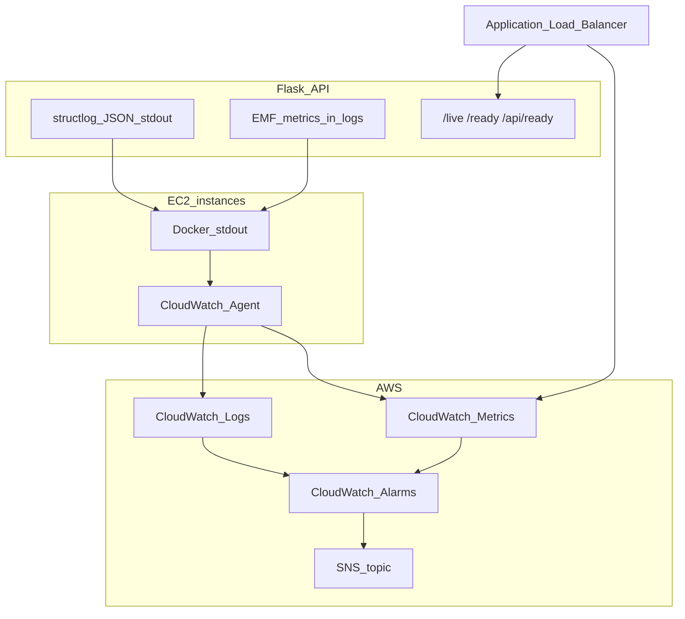

# Operations runbook

Operational guide for monitoring, alerting, and incident response for Ollama Chat on AWS. See [ARCHITECTURE.md](ARCHITECTURE.md) for topology and [DEPLOYMENT.md](DEPLOYMENT.md) for deploy procedures.

---

## Observability overview



| Layer | What you get |
|-------|----------------|
| **Application logs** | JSON lines (`request_started`, `request_completed`, `ollama_generate_completed`) with `request_id`, `route`, `duration_ms` |
| **Application metrics** | EMF namespace `OllamaChat`: `HttpRequestCount`, `HttpRequestLatencyMs`, `OllamaGenerateLatencyMs`, `OllamaGenerateCount` |
| **Host metrics** | CloudWatch agent → namespace `OllamaChat/EC2` (CPU, memory, disk) |
| **ALB metrics** | `UnHealthyHostCount`, `HealthyHostCount`, `HTTPCode_Target_5XX_Count` |
| **Alarms** | Terraform module `observability` (SNS email optional via `alarm_notification_email`) |

---

## Health endpoints

| Path | Role | Used by |
|------|------|---------|
| `GET /live` | **Liveness** — process up, no Ollama call | Docker `HEALTHCHECK`, operators |
| `GET /health` | Alias of `/live` (deprecated name) | Legacy clients |
| `GET /ready` | **Readiness** — Ollama + model available | Operators, K8s-style checks |
| `GET /api/health` | Same as `/live` | Backward compatibility |
| `GET /api/ready` | Same as `/ready` | **ALB target group health check** |

**Important:** Do not point the ALB at `/live` for registration. The ALB must keep `GET /api/ready` so instances are not registered until Ollama and `gemma:2b` are ready.

Example responses:

```bash
curl -s "http://${ALB_DNS}/live" | jq .
curl -s "http://${ALB_DNS}/api/ready" | jq .
```

Readiness includes `checks.ollama` with `status`, `latency_ms`, and `model`.

---

## Logs

### Log groups (Terraform)

| Log group | Source |
|-----------|--------|
| `/ollama-chat/flask/bootstrap` | `/var/log/ollama-chat-flask.log` |
| `/ollama-chat/flask/ollama-pull` | `/var/log/ollama-pull.log` |
| `/ollama-chat/flask/app` | Docker container JSON logs (Gunicorn/structlog stdout) |
| `/ollama-chat/react/bootstrap` | `/var/log/ollama-chat-react.log` |
| `/ollama-chat/react/app` | Frontend container logs |

Retention defaults to **14 days** (`log_retention_days` in Terraform).

### CloudWatch Logs Insights examples

**Recent API requests (latency):**

```
fields @timestamp, event, method, path, route, status, duration_ms
| filter event = "request_completed"
| sort @timestamp desc
| limit 50
```

**Ollama generate timing:**

```
fields @timestamp, event, model, duration_ms, ollama_total_duration_ns
| filter event = "ollama_generate_completed"
| sort @timestamp desc
| limit 20
```

**Errors:**

```
fields @timestamp, level, event, error
| filter level = "error" or level = "warning"
| sort @timestamp desc
| limit 50
```

### Agent status on an instance

```bash
sudo systemctl status amazon-cloudwatch-agent
sudo /opt/aws/amazon-cloudwatch-agent/bin/amazon-cloudwatch-agent-ctl -a status
```

---

## Metrics

### EMF (application)

Emitted as JSON lines to stdout when `METRICS_ENABLED=true` (default in production).

| Metric | Unit | Dimensions |
|--------|------|------------|
| `HttpRequestCount` | Count | Service, Environment, Method, Route, StatusCode |
| `HttpRequestLatencyMs` | Milliseconds | Same |
| `OllamaGenerateCount` | Count | Service, Environment, Model, Outcome |
| `OllamaGenerateLatencyMs` | Milliseconds | Same |

Probe paths (`/live`, `/health`, `/ready`, `/api/health`, `/api/ready`) are excluded from HTTP metrics to reduce noise.

In CloudWatch → **Metrics** → namespace **OllamaChat**, create graphs for latency percentiles after EMF extraction is active (may take a few minutes after first traffic).

### Infrastructure alarms

| Alarm | Meaning | First response |
|-------|---------|----------------|
| `ollama-chat-flask-unhealthy-hosts` | One or more Flask targets unhealthy | Check `/api/ready`, user-data logs, model pull |
| `ollama-chat-react-unhealthy-hosts` | React targets unhealthy | Check nginx container, `ollama-chat-react.log` |
| `ollama-chat-flask-no-healthy-hosts` | No healthy Flask targets | Critical — full API outage |
| `ollama-chat-flask-target-5xx` | Spike in target 5xx | App logs, Ollama errors |
| `ollama-chat-flask-asg-under-capacity` | In-service &lt; desired | ASG activity, instance failures |
| `ollama-chat-flask-cpu-high` | ASG average CPU &gt; 80% | Scale up, review chat load |

Subscribe to SNS: set `alarm_notification_email` in Terraform and confirm the AWS subscription email.

---

## Tracing (optional)

Disabled by default. Enable on the Flask container:

```bash
-e OTEL_ENABLED=true
-e OTEL_EXPORTER=console          # dev: spans to stderr
# -e OTEL_EXPORTER=otlp
# -e OTEL_EXPORTER_OTLP_ENDPOINT=http://collector:4318/v1/traces
```

Logs include `trace_id` and `span_id` when a span is active. For AWS X-Ray, run an ADOT collector on the host or sidecar and set `OTEL_EXPORTER=otlp` to the collector endpoint (not included in this repo).

---

## Common incidents

### All Flask targets unhealthy

1. Wait up to **600s** (ASG health check grace) during first boot.
2. SSM to a Flask instance: `aws ssm start-session --target <instance-id>`
3. `tail -f /var/log/ollama-chat-flask.log /var/log/ollama-pull.log`
4. `curl -s localhost:5000/api/ready`
5. Verify NACL allows ALB → private subnets ([ARCHITECTURE.md](ARCHITECTURE.md)).

### `/api/ready` 503 — model not ready

Ollama is still pulling `gemma:2b`. `/live` stays **200**. Wait for pull to finish or check `/var/log/ollama-pull.log`.

### High CPU

Review `OllamaChat/EC2` CPU metrics and chat rate. Consider increasing `flask_instance_type` or ASG `max`.

### 5xx from chat

Check `ollama_generate_bad_status` logs. Confirm Ollama on `127.0.0.1:11434` from the host (not from the internet).

### No logs in CloudWatch

1. Confirm log groups exist (Terraform `observability` module).
2. IAM: `CloudWatchAgentServerPolicy` + custom logs policy on EC2 role.
3. Agent running: `systemctl status amazon-cloudwatch-agent`.

---

## Useful commands

```bash
# ALB checks (from your workstation)
export ALB_DNS=$(terraform -chdir=infrastructure/terraform/environments/dev output -raw alb_dns_name)
curl -s "http://${ALB_DNS}/live" | jq .
curl -s "http://${ALB_DNS}/api/ready" | jq .

# Instance refresh after user-data change
./infrastructure/update-phase4.sh

# Terraform outputs
terraform -chdir=infrastructure/terraform/environments/dev output alarm_sns_topic_arn
terraform -chdir=infrastructure/terraform/environments/dev output cloudwatch_log_groups
```

### Legacy `deploy-aws.sh` deployments

That script does not create log groups or alarms. Either migrate to Terraform or manually:

- Attach `CloudWatchAgentServerPolicy` to EC2 roles
- Create the `/ollama-chat/*` log groups
- Create alarms matching the `observability` module

---

## Related docs

- [ARCHITECTURE.md](ARCHITECTURE.md) — network, ASG, health check matrix
- [DEPLOYMENT.md](DEPLOYMENT.md) — deploy paths and verification
- [backend/README.md](../backend/README.md) — local env vars and probe reference
