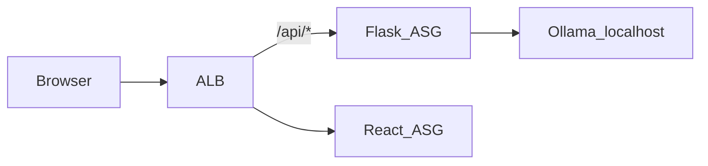

# Ollama Chat — Code Platoon & portfolio submission

**Repository:** [github.com/Bigessfour/ollama-chat](https://github.com/Bigessfour/ollama-chat)

**Reviewer path:** [README.md](../README.md) → [How to Demo](#quick-demo) → this document → [ARCHITECTURE.md](ARCHITECTURE.md) → [DEPLOYMENT.md](DEPLOYMENT.md)

Ollama Chat is a full-stack application that proxies [Ollama](https://ollama.com) through a Flask API and serves a React SPA, deployed on AWS behind an Application Load Balancer with private-subnet Auto Scaling Groups, SSM-backed secrets, and CloudWatch observability.

---

## Quick demo

| Mode | Guide |
|------|-------|
| Local (no AWS) | [README — How to Demo](../README.md#how-to-demo) Option A |
| Deployed stack | [README — How to Demo](../README.md#how-to-demo) Option B |
| Screenshots | [SCREENSHOTS.md](SCREENSHOTS.md) |

---

## Deployment evidence (fill in — do not commit secrets)

| Field | Your value |
|-------|------------|
| Deployment date | |
| AWS region | e.g. `us-east-1` |
| ALB DNS name | e.g. `ollama-chat-alb-xxxxxxxx.us-east-1.elb.amazonaws.com` |
| VPC ID | e.g. `vpc-xxxxxxxx` |
| Demo URL | `http://<ALB_DNS>/` |
| GitHub repo | https://github.com/Bigessfour/ollama-chat |

---

## Requirement traceability

Each row maps a challenge area to **evidence in this repository**. Use it for Code Platoon review and portfolio walkthroughs.

| Category | Requirement | Evidence |
|----------|-------------|----------|
| **Repository layout** | `backend/`, `frontend/`, `infrastructure/`, `docs/` | [README — Repository structure](../README.md#repository-structure) |
| **Documentation** | Overview, architecture, deployment | [README.md](../README.md), [ARCHITECTURE.md](ARCHITECTURE.md), [DEPLOYMENT.md](DEPLOYMENT.md) |
| **Local stack** | Ollama + Flask + React dev | [backend/README.md](../backend/README.md), [frontend/README.md](../frontend/README.md), [frontend/vite.config.js](../frontend/vite.config.js) (API proxy) |
| **API** | Health, readiness, chat | [backend/routes/health.py](../backend/routes/health.py), [backend/routes/chat.py](../backend/routes/chat.py), [backend/services/ollama_service.py](../backend/services/ollama_service.py) |
| **Frontend** | Chat UI wired to API | [frontend/src/components/chat/](../frontend/src/components/chat/), [frontend/src/api/client.js](../frontend/src/api/client.js) |
| **Containers** | Dockerfiles, multi-stage builds | [backend/Dockerfile](../backend/Dockerfile), [frontend/Dockerfile](../frontend/Dockerfile) |
| **Registry** | GHCR push/pull | [push-backend.sh](../infrastructure/push-backend.sh), [push-frontend.sh](../infrastructure/push-frontend.sh) |
| **AWS network** | VPC, public/private subnets, NAT | [terraform/modules/networking/](../infrastructure/terraform/modules/networking/) |
| **Load balancing** | ALB, `/api/*` → Flask | [terraform/modules/alb/](../infrastructure/terraform/modules/alb/), [ARCHITECTURE.md — ALB](ARCHITECTURE.md#application-load-balancer) |
| **Compute** | ASGs in private subnets | [terraform/modules/compute/](../infrastructure/terraform/modules/compute/), [user-data/flask.sh](../infrastructure/user-data/flask.sh) |
| **Secrets** | No PATs in git; SSM at runtime | [SECURITY.md](../SECURITY.md), [SECRETS.md](SECRETS.md), user-data SSM fetch only |
| **Observability** | Logs, metrics, probes, alarms | [OPERATIONS.md](OPERATIONS.md), [backend/utils/metrics.py](../backend/utils/metrics.py), [terraform/modules/observability/](../infrastructure/terraform/modules/observability/) |
| **CI** | Automated tests | [.github/workflows/ci.yml](../.github/workflows/ci.yml) |
| **License** | Open source terms | [LICENSE](../LICENSE) |

---

## Verification checklist

### Repository and documentation

- [ ] Repository contains `backend/`, `frontend/`, `infrastructure/`, and `docs/`
- [ ] [README.md](../README.md) — overview, architecture diagram, local dev, **How to Demo**
- [ ] [ARCHITECTURE.md](ARCHITECTURE.md) — VPC topology, security, scalability
- [ ] [DEPLOYMENT.md](DEPLOYMENT.md) — Terraform, CLI, and Console deploy paths
- [ ] [SUBMISSION.md](SUBMISSION.md) (this file) completed with deployment evidence

### Local development

- [ ] Ollama installed; `ollama pull gemma:2b` succeeds
- [ ] Backend responds on `/live`, `/api/ready`, and `/api/chat` (Docker `:5002` or `python run.py` `:5000`)
- [ ] Frontend dev server runs (`npm run dev` on port 5173)
- [ ] Vite proxy forwards `/api/*` to the backend

### Container registry

- [ ] GitHub PAT has `write:packages` and `read:packages`
- [ ] `ghcr.io/<org>/ollama-chat-backend:latest` pushed
- [ ] `ghcr.io/<org>/ollama-chat-frontend:latest` pushed with `VITE_API_URL=http://<ALB_DNS>`

### AWS infrastructure

- [ ] VPC with public and private subnets across 2 AZs
- [ ] NAT Gateway for private subnet egress
- [ ] ALB path rule `/api/*` → Flask; default → React
- [ ] Auto Scaling groups: Flask (`t3.large`), React (`t3.small`) in private subnets
- [ ] SSM `/ollama-chat/ghcr-pat` and IAM instance profiles for EC2
- [ ] All ALB target groups **healthy** (allow up to 10 minutes for Flask bootstrap)

### End-to-end verification

- [ ] `curl http://<ALB_DNS>/api/ready` → HTTP 200, readiness payload
- [ ] `curl http://<ALB_DNS>/live` → HTTP 200, `"status": "ok"`
- [ ] `curl -X POST http://<ALB_DNS>/api/chat` with JSON body → model response
- [ ] Browser loads SPA at `http://<ALB_DNS>/` and chat works

```bash
export ALB_DNS=<your-alb-dns-name>

curl -s "http://${ALB_DNS}/live" | jq .
curl -s "http://${ALB_DNS}/api/ready" | jq .
curl -s -X POST "http://${ALB_DNS}/api/chat" \
  -H 'Content-Type: application/json' \
  -d '{"message":"hello"}'
```

---

## Architecture summary



Full topology: [ARCHITECTURE.md](ARCHITECTURE.md).

---

## Deployment summary

| Step | Command / doc |
|------|----------------|
| Push backend | `./infrastructure/push-backend.sh` |
| Deploy AWS | [Terraform](../infrastructure/terraform/README.md) (recommended) or [DEPLOYMENT.md](DEPLOYMENT.md) |
| Push frontend | `export ALB_DNS=<dns> && ./infrastructure/push-frontend.sh` |
| Rollout updates | `./infrastructure/update-phase4.sh` |

Secrets: [SECRETS.md](SECRETS.md). Operations: [OPERATIONS.md](OPERATIONS.md).

---

## Known limitations

| Item | Status |
|------|--------|
| Chat UI | Implemented |
| CORS in production | Restricted to configured origins (not `*`) |
| HTTPS on ALB | HTTP :80 only |
| Streaming chat | Not implemented |
| Terraform IaC | [infrastructure/terraform/README.md](../infrastructure/terraform/README.md) |
| Teardown | Manual — [README#cleanup](../README.md#cleanup-instructions) |

---

## Related documentation

| Document | Purpose |
|----------|---------|
| [SCREENSHOTS.md](SCREENSHOTS.md) | What to capture for submission/portfolio |
| [SECRETS.md](SECRETS.md) | Credentials and env vars |
| [CHANGELOG.md](../CHANGELOG.md) | Release history |
| [CONTRIBUTING.md](../CONTRIBUTING.md) | How to contribute |
| [ollama-submission.md](ollama-submission.md) | Redirect to this file (legacy link) |
