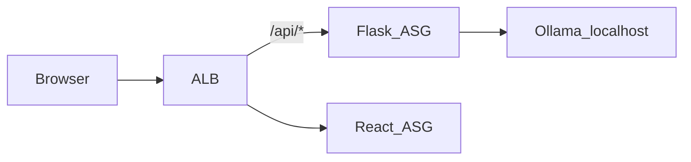

# Ollama Chat — Code Platoon Module 1 submission

**Repository:** [github.com/Bigessfour/ollama-chat](https://github.com/Bigessfour/ollama-chat)

**Reviewer path:** [README.md](../README.md) → [How to Demo](../README.md#how-to-demo) → this document → [ARCHITECTURE.md](ARCHITECTURE.md) → [DEPLOYMENT.md](DEPLOYMENT.md)

Ollama Chat is a full-stack application that proxies [Ollama](https://ollama.com) through a Flask API and serves a React SPA, deployed on AWS behind an Application Load Balancer with private-subnet Auto Scaling Groups, SSM-backed secrets, and CloudWatch observability.

---

## Quick demo

| Mode | Guide |
|------|-------|
| Local (no AWS) | [README — How to Demo](../README.md#how-to-demo) Option A |
| Deployed stack | [README — How to Demo](../README.md#how-to-demo) Option B |
| Verify deploy | `./infrastructure/scripts/verify-deployment.sh` (requires `ALB_DNS`) |
| Screenshots | [SCREENSHOTS.md](SCREENSHOTS.md) |

---

## Deployment evidence (fill in after AWS deploy — do not commit secrets)

Copy values from `terraform output` or `.aws-deploy-state` after deploy. Attach screenshots per [SCREENSHOTS.md](SCREENSHOTS.md) to the PR or course portal.

| Field | Your value |
|-------|------------|
| Deployment date | _YYYY-MM-DD_ |
| AWS region | e.g. `us-east-1` |
| ALB DNS name | `terraform output -raw alb_dns_name` |
| VPC ID | `terraform output -raw vpc_id` |
| Demo URL | `http://<ALB_DNS>/` |
| GHCR backend | `ghcr.io/<github-org>/ollama-chat-backend:latest` |
| GHCR frontend | `ghcr.io/<github-org>/ollama-chat-frontend:latest` |
| GitHub repo | https://github.com/Bigessfour/ollama-chat |

**Note on public access:** Both tiers run in **private subnets** behind the ALB (stronger than the starter brief’s public React tier). Users and the SPA reach the app at the **ALB DNS name**, not a React instance public IP.

---

## Code Platoon Module 1 — requirement mapping

| Challenge component | Status | Evidence |
|---------------------|--------|----------|
| Docker + multi-arch GHCR | Implemented | [backend/Dockerfile](../backend/Dockerfile), [frontend/Dockerfile](../frontend/Dockerfile), [push-*.sh](../infrastructure/), [build-and-push.yml](../.github/workflows/build-and-push.yml) |
| VPC (public + private, 2 AZ) | Implemented | [terraform/modules/networking/](../infrastructure/terraform/modules/networking/) |
| Internet Gateway | Implemented | `aws_internet_gateway` in networking module |
| NAT Gateway | Implemented | `aws_nat_gateway` + private routes |
| Security Groups (ALB / React / Flask) | Implemented | [terraform/modules/security/](../infrastructure/terraform/modules/security/) |
| Network ACL (Flask layer) | Implemented | Private NACL; deny 11434; allow 80/5000 from public CIDRs; SSH 22 from private CIDRs |
| Application Load Balancer | Implemented | [terraform/modules/alb/](../infrastructure/terraform/modules/alb/) — `/api/*` → Flask, default → React |
| EC2 launch templates | Implemented | [terraform/modules/compute/](../infrastructure/terraform/modules/compute/) |
| Auto Scaling (Flask min 2) | Implemented | `flask_asg_min = 2` default |
| Target groups + health checks | Implemented | Flask `/api/ready`, React `/` |
| IAM + SSM (optional) | Implemented | `AmazonSSMManagedInstanceCore`, `/ollama-chat/ghcr-pat` |
| Architecture diagram | Implemented | [ARCHITECTURE.md](ARCHITECTURE.md), [README](../README.md) |
| Flask ≥ 20 GB disk (Ollama) | Implemented | Flask launch template **30 GB gp3** encrypted root volume |
| SSH React → Flask | Implemented | `enable_ssh_between_tiers = true` (default); NACL + SG rules; use SSM to React first |

---

## Verification checklist

### Repository and documentation

- [x] Repository contains `backend/`, `frontend/`, `infrastructure/`, and `docs/`
- [x] [README.md](../README.md) — overview, architecture diagram, local dev, **How to Demo**
- [x] [ARCHITECTURE.md](ARCHITECTURE.md) — VPC topology, security, scalability
- [x] [DEPLOYMENT.md](DEPLOYMENT.md) — Terraform, CLI, and Console deploy paths
- [ ] [SUBMISSION.md](SUBMISSION.md) deployment evidence table filled after live deploy
- [ ] Screenshots captured per [SCREENSHOTS.md](SCREENSHOTS.md)

### Local development

- [x] Ollama + Flask + React documented; `gemma:2b` default model
- [x] Health routes: `/live`, `/api/ready`, `/api/chat`
- [x] Vite dev proxy for `/api/*`

### Container registry

- [ ] GitHub PAT with `write:packages` and `read:packages`
- [ ] `ghcr.io/<org>/ollama-chat-backend:latest` pushed
- [ ] `ghcr.io/<org>/ollama-chat-frontend:latest` pushed with `VITE_API_URL=http://<ALB_DNS>`

### AWS infrastructure (confirm after deploy)

- [ ] VPC with public and private subnets across 2 AZs
- [ ] NAT Gateway for private subnet egress
- [ ] ALB path rule `/api/*` → Flask; default → React
- [ ] ASGs: Flask `t3.large`, React `t3.small`, min 2 each, private subnets
- [ ] SSM `/ollama-chat/ghcr-pat` and instance profiles
- [ ] All ALB target groups **healthy** (allow up to 10 minutes for Flask bootstrap)

### End-to-end (confirm after deploy)

- [ ] `curl http://<ALB_DNS>/api/ready` → HTTP 200
- [ ] `curl http://<ALB_DNS>/live` → HTTP 200
- [ ] `curl -X POST http://<ALB_DNS>/api/chat` → model response
- [ ] Browser loads SPA at `http://<ALB_DNS>/` and chat works
- [ ] Flask **not** reachable on :5000 from the public internet (only via ALB)
- [ ] SSH from React instance to Flask private IP (via SSM → React → `ssh ec2-user@<flask-ip>`)

```bash
export ALB_DNS=<your-alb-dns-name>
./infrastructure/scripts/verify-deployment.sh
```

### Debug SSH (React → Flask)

1. **Session Manager** → connect to a **React** EC2 instance (`Tier=frontend`).
2. List Flask private IPs:  
   `aws ec2 describe-instances --filters "Name=tag:Tier,Values=backend" "Name=instance-state-name,Values=running" --query 'Reservations[].Instances[].PrivateIpAddress' --output text`
3. `ssh ec2-user@<flask-private-ip>` (Amazon Linux 2023 key is instance key pair if configured; otherwise use SSM port forwarding).

Terraform hint: `terraform output debug_ssh_hint`

---

## Requirement traceability (portfolio)

| Category | Requirement | Evidence |
|----------|-------------|----------|
| **Repository layout** | `backend/`, `frontend/`, `infrastructure/`, `docs/` | [README — Repository structure](../README.md#repository-structure) |
| **Documentation** | Overview, architecture, deployment | [README.md](../README.md), [ARCHITECTURE.md](ARCHITECTURE.md), [DEPLOYMENT.md](DEPLOYMENT.md) |
| **Local stack** | Ollama + Flask + React dev | [backend/README.md](../backend/README.md), [frontend/README.md](../frontend/README.md) |
| **API** | Health, readiness, chat | [backend/routes/](../backend/routes/) |
| **Frontend** | Chat UI | [frontend/src/components/chat/](../frontend/src/components/chat/) |
| **Containers** | Dockerfiles | [backend/Dockerfile](../backend/Dockerfile), [frontend/Dockerfile](../frontend/Dockerfile) |
| **Registry** | GHCR | [push-backend.sh](../infrastructure/push-backend.sh), [push-frontend.sh](../infrastructure/push-frontend.sh) |
| **AWS** | VPC, ALB, ASG, NACL, IAM | [terraform/](../infrastructure/terraform/) |
| **CI** | Tests | [.github/workflows/ci.yml](../.github/workflows/ci.yml) |

---

## Architecture summary



Full topology: [ARCHITECTURE.md](ARCHITECTURE.md).

---

## Deployment summary

| Step | Command / doc |
|------|----------------|
| Push backend | `./infrastructure/push-backend.sh` |
| Deploy AWS | [Terraform](../infrastructure/terraform/README.md) (recommended) or [DEPLOYMENT.md](DEPLOYMENT.md) |
| Push frontend | `export ALB_DNS=$(terraform -chdir=infrastructure/terraform/environments/dev output -raw alb_dns_name) && ./infrastructure/push-frontend.sh` |
| Verify | `export ALB_DNS=... && ./infrastructure/scripts/verify-deployment.sh` |
| Rollout updates | `./infrastructure/update-phase4.sh` |

Secrets: [SECRETS.md](SECRETS.md). Operations: [OPERATIONS.md](OPERATIONS.md).

---

## Related documentation

| Document | Purpose |
|----------|---------|
| [SCREENSHOTS.md](SCREENSHOTS.md) | Screenshot capture guide |
| [SECRETS.md](SECRETS.md) | Credentials and env vars |
| [CHANGELOG.md](../CHANGELOG.md) | Release history |
