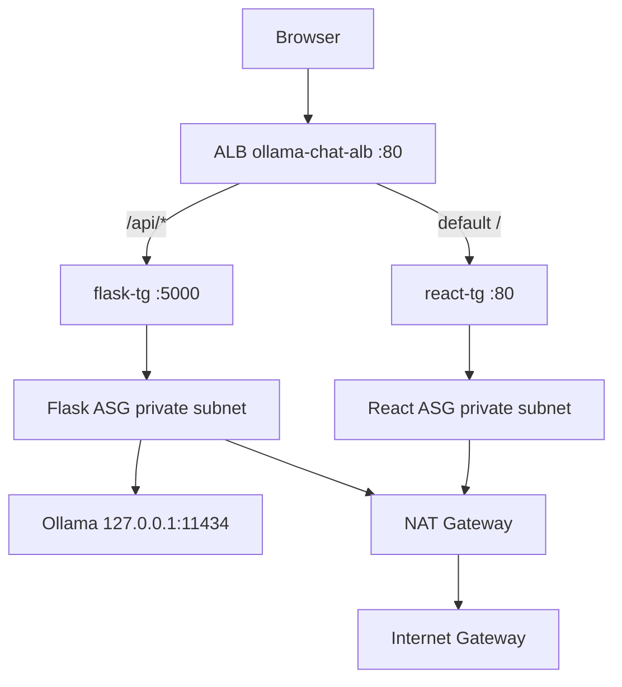

# Ollama Chat — Development Log

> Running log of steps taken and rationale. Append new entries at the bottom as work continues.

**Repository:** [Bigessfour/ollama-chat](https://github.com/Bigessfour/ollama-chat)  
**Last updated:** 2026-05-23

---

## Step 1 — Clone repository and scaffold project layout

**What we did**

```bash
git clone https://github.com/Bigessfour/ollama-chat.git
cd ollama-chat
mkdir -p backend frontend infrastructure docs
```

**Why**

- Start from the GitHub remote as the source of truth.
- Split the app into clear boundaries early: API (`backend`), UI (`frontend`), deployment/ops (`infrastructure`), and documentation (`docs`).
- The repo was empty at clone time, so this structure defines how the project will grow.

---

## Step 2 — Define backend Python dependencies

**What we did**

Created `backend/requirements.txt`:

```
flask==3.0.3
flask-cors==4.0.1
requests==2.32.3
gunicorn==22.0.0
```

Also added wrapper files at the repo root and `ollama-chat/` that point to the backend file (`-r backend/requirements.txt`) so `pip install -r requirements.txt` works from more than one directory.

**Why**

| Package | Purpose |
|---------|---------|
| `flask` | Lightweight HTTP API for health checks and chat proxy |
| `flask-cors` | Allow the React dev server (different origin/port) to call the API |
| `requests` | Forward chat prompts to the Ollama HTTP API |
| `gunicorn` | Production WSGI server inside Docker / ECS (not Flask’s dev server) |

Pinned versions keep local, Docker, and future CI builds reproducible.

---

## Step 3 — Set up Python virtual environment

**What we did**

```bash
python3 -m venv .venv   # backend/.venv and parent Ollama-Chat/.venv
source .venv/bin/activate
pip install -r requirements.txt
```

**Why**

- macOS Python is “externally managed” (PEP 668); installing packages globally fails without a venv.
- Isolates project dependencies from the system Python and other projects.

---

## Step 4 — Implement Flask API (`backend/app.py`)

**What we did**

Built a small proxy API with two routes:

| Route | Method | Behavior |
|-------|--------|----------|
| `/api/health` | GET | Ping Ollama `/api/tags`; return status + model name |
| `/api/chat` | POST | Accept `{ "message": "..." }`, forward to Ollama `/api/generate` |

Configuration:

- `OLLAMA_URL` env var (default `http://localhost:11434`)
- `MODEL = "gemma:2b"`
- CORS enabled for all origins (to be tightened before production)

**Why**

- The browser should not talk to Ollama directly; the backend centralizes model name, timeouts, and error handling.
- `/api/health` gives a quick way to verify Ollama connectivity before debugging chat.
- Non-streaming `/api/generate` keeps the first version simple; streaming can be added later.

---

## Step 5 — Pull Ollama model

**What we did**

```bash
ollama pull gemma:2b
```

**Why**

- The backend is hard-coded to `gemma:2b`. Without the model pulled, chat requests fail at runtime.
- Initially only `llama3.2:1b` was installed; pulling `gemma:2b` aligned the runtime with the code.

---

## Step 6 — Containerize the backend

**What we did**

Created `backend/Dockerfile`:

- Base: `python:3.11-slim`
- Install from `requirements.txt`
- Run with gunicorn on port 5000 (2 workers, 4 threads)

Local run example:

```bash
docker build -t ollama-chat-backend ./backend
docker run -p 5002:5000 -e OLLAMA_URL=http://host.docker.internal:11434 ollama-chat-backend
```

**Why**

- Docker matches the target deployment model (ECS/Fargate).
- `host.docker.internal` lets a container reach Ollama on the Mac host.
- Port **5002** was used locally because **5000** is often taken by macOS AirPlay and **5001** was already used by another project.

---

## Step 7 — Scaffold React frontend (Vite)

**What we did**

```bash
cd frontend
npm create vite@latest . -- --template react
npm install
```

**Why**

- Vite gives fast HMR for local development and a simple production build.
- React is a standard choice for a chat UI with component-based message lists and input handling.

---

## Step 8 — Frontend folder structure and API client

**What we did**

Added standard directories and starter files:

```
frontend/src/
├── api/client.js       # getHealth(), sendChatMessage()
├── components/
├── constants/config.js # VITE_API_BASE_URL
├── hooks/
├── pages/
├── styles/
└── utils/
```

Also added:

- `frontend/requirements.txt` — documents Node/npm prerequisites and packages (mirrors `package.json`)
- `frontend/.env.example`
- Vite dev proxy: `/api` → backend (initially `localhost:5002`)

**Why**

- Separating `api/`, `components/`, and `hooks/` keeps the chat UI maintainable as it grows.
- `api/client.js` centralizes fetch logic and error handling.
- A dependency manifest in `requirements.txt` parallels the backend and helps anyone onboarding without reading `package.json` alone.

---

## Step 9 — Environment variable strategy (`VITE_API_BASE_URL`)

**What we did**

Standardized on **`VITE_API_BASE_URL`** (not `VITE_API_URL`):

- **Local dev:** leave empty → requests use relative `/api/*` through the Vite proxy
- **Production Docker build:** set to `http://<ALB-DNS>` at build time

Updated `src/constants/config.js`:

```js
export const API_BASE_URL = import.meta.env.VITE_API_BASE_URL ?? ''
```

**Why**

- Empty base URL + Vite proxy avoids hardcoding `localhost:5002` in frontend code.
- Vite bakes env vars at **build** time, so production needs the ALB URL when the image is built—not at container runtime.
- `VITE_API_BASE_URL` is clearer than `VITE_API_URL` because the app appends paths like `/api/chat`.

---

## Step 10 — GHCR multi-arch image plan and Docker scaffold

**What we did**

**Auth & builder**

```bash
docker login ghcr.io -u Bigessfour
docker buildx create --use --name multiarch
```

**Backend image (target)**

```bash
docker buildx build \
  --platform linux/amd64,linux/arm64 \
  -t ghcr.io/bigessfour/ollama-chat-backend:latest \
  --push ./backend
```

**Frontend Docker (added before ALB exists)**

- `frontend/Dockerfile` — Node build stage + nginx runtime
- `frontend/nginx.conf` — SPA `try_files` fallback
- `frontend/.dockerignore`, `backend/.dockerignore`

**Push scripts**

- `infrastructure/push-backend.sh`
- `infrastructure/push-frontend.sh` (requires `ALB_DNS` + `GHCR_PAT`)

**Why**

- **Multi-arch (`linux/amd64`, `linux/arm64`):** ECS Fargate and local Mac (ARM) need different architectures from one pipeline.
- **GHCR:** Host images alongside the GitHub repo under `ghcr.io/bigessfour/`.
- **Frontend nginx image:** Production serves static files; API calls go to the ALB, not nginx.
- **Build-time `VITE_API_BASE_URL`:** Browser must know the public ALB hostname after deploy.
- **Deferred frontend push:** ALB DNS is not available yet; backend push blocked on PAT scope (see Step 11).

**Target architecture**

```
Browser → ALB → /     → frontend (nginx)
              → /api/* → backend (gunicorn) → Ollama
```

---

## Step 11 — GHCR push attempt and blocker

**What we did**

- Verified multi-arch **builds** succeed for both backend and frontend (without push).
- Attempted push to `ghcr.io/bigessfour/ollama-chat-backend:latest`.
- Login via `gh auth token` succeeded for read operations; **push failed** with `permission_denied: The token provided does not match expected scopes`.

**Why it failed**

The GitHub CLI token had `repo`, `gist`, `read:org` but not **`write:packages`**. GHCR pushes require that scope.

**Resolution (pending)**

```bash
# Option A: PAT with write:packages
export GHCR_PAT=your_pat_here
./infrastructure/push-backend.sh

# Option B: refresh gh auth (interactive)
gh auth refresh -h github.com -s write:packages
```

When ALB DNS is ready:

```bash
export GHCR_PAT=your_pat_here
export ALB_DNS=your-alb-hostname.elb.amazonaws.com
./infrastructure/push-frontend.sh
```

---

## Step 12 — Phase 3 AWS Infrastructure

**Region:** `us-east-1`  
**Deploy method:** AWS Console (steps below) or [infrastructure/deploy-aws.sh](../infrastructure/deploy-aws.sh)  
**Account:** `388691194728`

### Architecture overview



**Why path-based ALB + Ollama on Flask EC2**

- One public URL for SPA and API; frontend image built with `VITE_API_BASE_URL=http://<ALB-DNS>`.
- Ollama stays on localhost inside the Flask instance — not exposed on the internet.
- Private subnets for app tier; only ALB sits in public subnets.

**AWS reference:** [Create a VPC](https://docs.aws.amazon.com/vpc/latest/userguide/create-vpc.html)

---

### 12.1 — Prerequisites

1. AWS CLI configured (`aws sts get-caller-identity`).
2. Backend and frontend Dockerfiles committed (Steps 6 and 10).
3. GitHub PAT with **`write:packages`** (push) and **`read:packages`** (EC2 pull).

```bash
export GHCR_PAT=your_pat_here
./infrastructure/push-backend.sh
export ALB_DNS=ollama-chat-alb-2089677702.us-east-1.elb.amazonaws.com
./infrastructure/push-frontend.sh
```

---

### 12.2 — Part A: VPC and networking

#### A1. Create VPC

**Console:** VPC → Create VPC → **VPC and more**

| Setting | Value |
|---------|-------|
| Name | `ollama-chat-vpc` |
| IPv4 CIDR | `10.0.0.0/16` |
| AZs / public / private subnets | 2 each |
| NAT gateways | 1 |
| DNS hostnames + resolution | **Enable** |

| Subnet | AZ | CIDR | Type |
|--------|-----|------|------|
| Public-1a | us-east-1a | `10.0.1.0/24` | Public |
| Public-1b | us-east-1b | `10.0.2.0/24` | Public |
| Private-1a | us-east-1a | `10.0.10.0/24` | Private |
| Private-1b | us-east-1b | `10.0.11.0/24` | Private |

**Deployed VPC ID:** `vpc-0c4c84ae38d0a7f51`

#### A2. Internet Gateway + public routes

- Create and attach IGW to VPC.
- Public route table: `0.0.0.0/0` → IGW; associate public subnets.

**AWS reference:** [NAT gateway use cases](https://docs.aws.amazon.com/vpc/latest/userguide/nat-gateway-scenarios.html)

#### A3. NAT Gateway + private routes

1. Allocate Elastic IP.
2. Create NAT in Public-1a.
3. Private route table: `0.0.0.0/0` → NAT; associate private subnets.

#### A4. Network ACLs (private subnets)

| Rule | Direction | Port | Source/Dest | Allow |
|------|-----------|------|-------------|-------|
| 100 | Inbound | 80, 5000 | `10.0.1.0/24`, `10.0.2.0/24` | Yes |
| 120 | Inbound | 1024–65535 | public subnet CIDRs | Yes |
| 100 | Outbound | 443 | `0.0.0.0/0` | Yes |
| 110 | Outbound | 1024–65535 | public subnet CIDRs | Yes |

**AWS reference:** [Custom network ACLs](https://docs.aws.amazon.com/vpc/latest/userguide/custom-network-acl.html)

---

### 12.3 — Part B: Security groups

| SG | Inbound | Notes |
|----|---------|-------|
| `ollama-chat-alb-sg` | TCP 80, 443 from `0.0.0.0/0` | Internet-facing ALB |
| `ollama-chat-react-sg` | TCP 80 from alb-sg | nginx only from ALB |
| `ollama-chat-flask-sg` | TCP 5000 from alb-sg; TCP 22 from react-sg | No port 11434 |

**AWS reference:** [Security groups](https://docs.aws.amazon.com/vpc/latest/userguide/vpc-security-groups.html)

---

### 12.4 — Part C: IAM and SSM

**Role:** `ollama-chat-ec2-ssm-role` with `AmazonSSMManagedInstanceCore` + inline `ghcr-pat-read`:

```json
{
  "Version": "2012-10-17",
  "Statement": [{
    "Effect": "Allow",
    "Action": ["ssm:GetParameter", "ssm:GetParameters"],
    "Resource": "arn:aws:ssm:us-east-1:388691194728:parameter/ollama-chat/ghcr-pat"
  }]
}
```

**SSM parameter:** `/ollama-chat/ghcr-pat` (SecureString) — GitHub PAT with `read:packages`.

**AWS reference:** [SSM instance profile](https://docs.aws.amazon.com/systems-manager/latest/userguide/session-manager-getting-started-instance-profile.html)  
**GHCR reference:** [Container registry](https://docs.github.com/en/packages/working-with-a-github-packages-registry/working-with-the-container-registry)

---

### 12.5 — Part D: Application Load Balancer

#### Target groups

| Name | Port | Health path | ARN suffix |
|------|------|-------------|------------|
| `ollama-chat-flask-tg` | 5000 | `/api/health` | `.../140644381166265e` |
| `ollama-chat-react-tg` | 80 | `/` | `.../f6e8212eecbe2f7e` |

#### ALB + listener

| Setting | Value |
|---------|-------|
| Name | `ollama-chat-alb` |
| Scheme | Internet-facing |
| Subnets | Public-1a, Public-1b |
| DNS | `ollama-chat-alb-2089677702.us-east-1.elb.amazonaws.com` |

| Priority | Path | Target |
|----------|------|--------|
| 1 | `/api/*` | flask-tg |
| default | `/` | react-tg |

**AWS reference:** [Create target group](https://docs.aws.amazon.com/elasticloadbalancing/latest/application/create-target-group.html) | [Listener rules](https://docs.aws.amazon.com/elasticloadbalancing/latest/application/add-rule.html)

---

### 12.6 — Part E: Launch templates and ASGs

| Resource | Instance | User data |
|----------|----------|-----------|
| `ollama-chat-flask-lt` | t3.large, AL2023 | [flask.sh](../infrastructure/user-data/flask.sh) — Docker, Ollama, `gemma:2b`, GHCR backend |
| `ollama-chat-react-lt` | t3.small, AL2023 | [react.sh](../infrastructure/user-data/react.sh) — Docker, GHCR frontend nginx |

| ASG | Subnets | Capacity | Target group |
|-----|---------|----------|--------------|
| `ollama-chat-flask-asg` | Private-1a/b | 2–4 (desired 2) | flask-tg |
| `ollama-chat-react-asg` | Private-1a/b | 2–4 (desired 2) | react-tg |

ELB health checks enabled (flask grace **600s**, react grace **300s**). See Step 13 for Phase 4 user-data details.

**AWS reference:** [Launch templates](https://docs.aws.amazon.com/AWSEC2/latest/UserGuide/ec2-launch-templates.html) | [Auto Scaling](https://docs.aws.amazon.com/autoscaling/ec2/userguide/create-asg-launch-template.html)  
**Ollama:** [API docs](https://github.com/ollama/ollama/blob/main/docs/api.md) | [Install](https://ollama.com/download)

---

### 12.7 — Automated deploy

```bash
export GHCR_PAT=your_pat_with_read_packages
./infrastructure/deploy-aws.sh
```

---

### 12.8 — GHCR unblock checklist

1. Create PAT with `write:packages` + `read:packages`.
2. Update SSM: `aws ssm put-parameter --name /ollama-chat/ghcr-pat --type SecureString --value "$GHCR_PAT" --overwrite --region us-east-1`
3. `./infrastructure/push-backend.sh`
4. `export ALB_DNS=ollama-chat-alb-2089677702.us-east-1.elb.amazonaws.com && ./infrastructure/push-frontend.sh`
5. Instance refresh on both ASGs.

**Docker reference:** [Multi-platform builds](https://docs.docker.com/build/building/multi-platform/)

---

### 12.9 — Verification

```bash
curl http://ollama-chat-alb-2089677702.us-east-1.elb.amazonaws.com/api/health
curl -X POST http://ollama-chat-alb-2089677702.us-east-1.elb.amazonaws.com/api/chat \
  -H 'Content-Type: application/json' -d '{"message":"hello"}'
```

**Status (2026-05-23):** ALB deployed; targets healthy after Phase 4 rollout (Step 13).

**AWS reference:** [ALB health checks](https://docs.aws.amazon.com/elasticloadbalancing/latest/application/modify-health-check-settings.html)

---

### 13 — Phase 4: User data scripts and ASG rollout

Phase 4 updates EC2 boot scripts for faster Flask startup (host networking, deferred Ollama model pull) while **keeping SSM-based GHCR login** for private container images.

#### 13.1 — Flask launch template user data

Source: [infrastructure/user-data/flask.sh](../infrastructure/user-data/flask.sh)

```bash
#!/bin/bash
set -e

dnf update -y || yum update -y
dnf install -y docker aws-cli
systemctl enable --now docker
usermod -aG docker ec2-user

curl -fsSL https://ollama.com/install.sh | sh
systemctl enable --now ollama || true

nohup bash -c 'export HOME=/root; sleep 15; ollama pull gemma:2b' \
  > /var/log/ollama-pull.log 2>&1 &

TOKEN=$(curl -s -X PUT "http://169.254.169.254/latest/api/token" \
  -H "X-aws-ec2-metadata-token-ttl-seconds: 21600")
REGION=$(curl -s -H "X-aws-ec2-metadata-token: $TOKEN" \
  http://169.254.169.254/latest/meta-data/placement/region)

PAT=$(aws ssm get-parameter --name /ollama-chat/ghcr-pat --with-decryption \
  --region "$REGION" --query Parameter.Value --output text)
echo "$PAT" | docker login ghcr.io -u Bigessfour --password-stdin

docker pull ghcr.io/bigessfour/ollama-chat-backend:latest
docker run -d --restart unless-stopped --network host \
  --name backend \
  -e OLLAMA_URL=http://localhost:11434 \
  ghcr.io/bigessfour/ollama-chat-backend:latest

echo "Flask + Ollama startup complete" > /var/log/user-data.log
```

Key changes from Phase 3:

- `--network host` instead of `-p 5000:5000` (gunicorn still listens on port 5000)
- Deferred `ollama pull gemma:2b` so the Flask container starts before the model download
- Fixed IMDSv2 token URL (`/latest/api/token`) so SSM PAT retrieval works on boot
- Logs: `/var/log/user-data.log`, `/var/log/ollama-pull.log`

#### 13.2 — React launch template user data

Source: [infrastructure/user-data/react.sh](../infrastructure/user-data/react.sh)

```bash
#!/bin/bash
set -e

dnf install -y docker aws-cli
systemctl enable --now docker

TOKEN=$(curl -s -X PUT "http://169.254.169.254/latest/api/token" \
  -H "X-aws-ec2-metadata-token-ttl-seconds: 21600")
REGION=$(curl -s -H "X-aws-ec2-metadata-token: $TOKEN" \
  http://169.254.169.254/latest/meta-data/placement/region)

PAT=$(aws ssm get-parameter --name /ollama-chat/ghcr-pat --with-decryption \
  --region "$REGION" --query Parameter.Value --output text)
echo "$PAT" | docker login ghcr.io -u Bigessfour --password-stdin

docker pull ghcr.io/bigessfour/ollama-chat-frontend:latest
docker run -d --restart unless-stopped -p 80:80 --name frontend \
  ghcr.io/bigessfour/ollama-chat-frontend:latest
```

#### 13.3 — ASG settings

| ASG | Min | Desired | Max | Health check grace |
|-----|-----|---------|-----|--------------------|
| `ollama-chat-flask-asg` | 2 | 2 | 4 | **600s** |
| `ollama-chat-react-asg` | 2 | 2 | 4 | 300s |

#### 13.4 — Automated rollout (existing stack)

Prerequisites: GHCR images pushed; SSM `/ollama-chat/ghcr-pat` updated with a valid PAT.

```bash
export GHCR_PAT=your_pat_with_read_packages
aws ssm put-parameter --name /ollama-chat/ghcr-pat --type SecureString \
  --value "$GHCR_PAT" --overwrite --region us-east-1

./infrastructure/push-backend.sh
export ALB_DNS=ollama-chat-alb-2089677702.us-east-1.elb.amazonaws.com
./infrastructure/push-frontend.sh

./infrastructure/update-phase4.sh
```

`update-phase4.sh` creates new launch template versions, updates ASG capacity/grace, and starts instance refresh.

#### 13.5 — Private subnet NACL (required for health checks)

The custom NACL on private subnets (`acl-02e319289a1d57226`) was associated without allow rules, blocking NAT outbound traffic and ALB health checks. Required rules:

| Rule | Direction | Ports | CIDR | Action |
|------|-----------|-------|------|--------|
| 100 | Outbound | All | `0.0.0.0/0` | Allow |
| 100–103 | Inbound | 80, 5000 | `10.0.1.0/24`, `10.0.2.0/24` | Allow |
| 110 | Inbound | 1024–65535 | `0.0.0.0/0` | Allow (ephemeral return) |

**AWS reference:** [Custom network ACLs](https://docs.aws.amazon.com/vpc/latest/userguide/custom-network-acl.html)

#### 13.6 — Verification

```bash
curl http://ollama-chat-alb-2089677702.us-east-1.elb.amazonaws.com/api/health
curl -X POST http://ollama-chat-alb-2089677702.us-east-1.elb.amazonaws.com/api/chat \
  -H 'Content-Type: application/json' -d '{"message":"hello"}'
```

**Status (2026-05-23):** `/api/health` returns HTTP 200 with `status: healthy`. `/api/chat` succeeds after `gemma:2b` finishes pulling (check `/var/log/ollama-pull.log` on flask instances). All four ALB targets healthy.

---

### Reference documentation

#### AWS

| Topic | Documentation |
|-------|----------------|
| Create VPC | https://docs.aws.amazon.com/vpc/latest/userguide/create-vpc.html |
| NAT gateway scenarios | https://docs.aws.amazon.com/vpc/latest/userguide/nat-gateway-scenarios.html |
| Custom network ACLs | https://docs.aws.amazon.com/vpc/latest/userguide/custom-network-acl.html |
| Security groups | https://docs.aws.amazon.com/vpc/latest/userguide/vpc-security-groups.html |
| Create ALB target group | https://docs.aws.amazon.com/elasticloadbalancing/latest/application/create-target-group.html |
| ALB listener rules | https://docs.aws.amazon.com/elasticloadbalancing/latest/application/add-rule.html |
| ALB health checks | https://docs.aws.amazon.com/elasticloadbalancing/latest/application/modify-health-check-settings.html |
| EC2 launch templates | https://docs.aws.amazon.com/AWSEC2/latest/UserGuide/ec2-launch-templates.html |
| Auto Scaling launch template | https://docs.aws.amazon.com/autoscaling/ec2/userguide/create-asg-launch-template.html |
| SSM instance profile | https://docs.aws.amazon.com/systems-manager/latest/userguide/session-manager-getting-started-instance-profile.html |
| ELB getting started | https://aws.amazon.com/elasticloadbalancing/getting-started/ |

#### Application packages

| Package | Documentation |
|---------|----------------|
| Flask | https://flask.palletsprojects.com/en/latest/ |
| Flask-CORS | https://flask-cors.readthedocs.io/ |
| Gunicorn | https://docs.gunicorn.org/en/stable/ |
| Python requests | https://requests.readthedocs.io/ |
| Vite env vars | https://vite.dev/guide/env-and-mode |
| React | https://react.dev/ |
| Ollama API | https://github.com/ollama/ollama/blob/main/docs/api.md |
| Ollama install | https://ollama.com/download |
| GHCR | https://docs.github.com/en/packages/working-with-a-github-packages-registry/working-with-the-container-registry |
| Docker multi-platform | https://docs.docker.com/build/building/multi-platform/ |
| nginx | https://nginx.org/en/docs/ |

---

## Current project state

| Area | Status |
|------|--------|
| Backend API | Implemented (`app.py`) |
| Backend Docker | Pushed to GHCR (`ghcr.io/bigessfour/ollama-chat-backend:latest`) |
| Ollama model | `gemma:2b` pulled on boot (deferred background pull) |
| Frontend scaffold | Vite + React + folder structure |
| Frontend API client | Stub (`getHealth`, `sendChatMessage`) |
| Chat UI | Not yet built (still Vite starter template) |
| Frontend Docker | Pushed to GHCR with ALB `VITE_API_BASE_URL` |
| AWS infrastructure | Deployed in **us-east-1** — Steps 12–13 |
| ALB DNS | `ollama-chat-alb-2089677702.us-east-1.elb.amazonaws.com` |
| Target health | **Healthy** (Phase 4 rollout complete) |

---

## Local development quick reference

```bash
# Terminal 1 — backend (Docker)
docker run -p 5002:5000 -e OLLAMA_URL=http://host.docker.internal:11434 ollama-chat-backend

# Terminal 2 — frontend
cd frontend
cp .env.example .env   # VITE_API_BASE_URL= (empty)
npm run dev            # http://localhost:5173
```

---

## Next steps (to be appended as completed)

- [x] Obtain GHCR PAT with `write:packages`; push backend + frontend images
- [x] Deploy ALB + target groups (frontend + backend)
- [x] Push frontend image with `VITE_API_BASE_URL=http://<ALB-DNS>`
- [x] Update SSM `/ollama-chat/ghcr-pat` with valid PAT; Phase 4 user-data + instance refresh
- [ ] Build chat UI components (message list, input, loading/error states)
- [ ] Tighten CORS to ALB origin only
- [ ] Add streaming chat support (optional)

---

*Add new steps below this line as development continues.*
