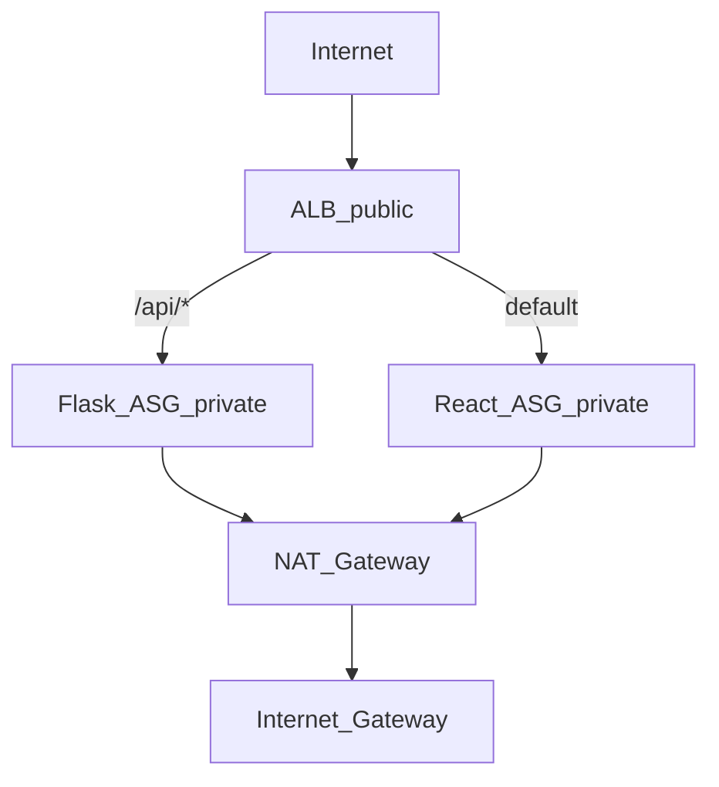

# Ollama Chat — Terraform Infrastructure

Production-grade Infrastructure as Code for the Ollama Chat AWS stack. This is the **recommended deployment path** going forward.

Legacy alternatives remain available:

- [../deploy-aws.sh](../deploy-aws.sh) — bash / AWS CLI
- [../../docs/DEPLOYMENT.md](../../docs/DEPLOYMENT.md) Path B — AWS Console

---

## Architecture



| Module | Resources |
|--------|-----------|
| `modules/networking` | VPC, subnets, IGW, NAT, route tables, **private NACLs** (deny 11434) |
| `modules/security` | ALB, Flask, React security groups; optional SSH between tiers |
| `modules/iam` | **Split** Flask/React EC2 roles and instance profiles; SSM (`/ollama-chat/ghcr-pat`, optional `/ollama-chat/api-key`) |
| `modules/alb` | ALB, target groups, HTTP listener, `/api/*` rule |
| `modules/compute` | Launch templates (IMDSv2 required), Auto Scaling groups |

---

## Quick start (dev environment)

### Prerequisites

- Terraform >= 1.5.0
- AWS CLI configured (`aws sts get-caller-identity`)
- Docker images built separately (Terraform does not build/push containers)

### 1. Configure variables

```bash
cd infrastructure/terraform/environments/dev
cp terraform.tfvars.example terraform.tfvars
# Edit terraform.tfvars OR:
export TF_VAR_ghcr_pat='your_github_pat_with_read_packages'
export TF_VAR_api_key='your-random-api-key'   # optional — /ollama-chat/api-key in SSM
```

Never commit `terraform.tfvars` or real PAT/API key values. See [../../SECURITY.md](../../SECURITY.md).

### 2. Initialize and apply

```bash
terraform init
terraform plan
terraform apply
```

### 3. Push container images

```bash
cd ../../../..   # repository root (ollama-chat/)
export GHCR_PAT='your_pat'
./infrastructure/push-backend.sh

export ALB_DNS=$(terraform -chdir=infrastructure/terraform/environments/dev output -raw alb_dns_name)
./infrastructure/push-frontend.sh
```

### 4. Verify

```bash
curl "http://${ALB_DNS}/api/ready"
curl -X POST "http://${ALB_DNS}/api/chat" \
  -H 'Content-Type: application/json' \
  -d '{"message":"hello"}'
```

Allow up to 10 minutes for Flask instances (Ollama install + `gemma:2b` pull).

---

## Directory layout

```
infrastructure/terraform/
├── README.md                 # This file
├── modules/
│   ├── networking/
│   ├── security/
│   ├── iam/
│   ├── alb/
│   └── compute/
├── bootstrap/                # Optional S3 + DynamoDB state setup
└── environments/
    └── dev/                  # Apply entry point
        ├── main.tf
        ├── variables.tf
        ├── outputs.tf
        ├── providers.tf
        ├── backend.tf        # Commented S3 backend template
        └── terraform.tfvars.example
```

---

## Key variables (dev)

| Variable | Default | Description |
|----------|---------|-------------|
| `aws_region` | `us-east-1` | AWS region |
| `ghcr_pat` | (required) | GitHub PAT → SSM `/ollama-chat/ghcr-pat` |
| `api_key` | `""` | Optional Flask API key → SSM `/ollama-chat/api-key` when set (`TF_VAR_api_key`) |
| `vpc_cidr` | `10.0.0.0/16` | VPC CIDR |
| `single_nat_gateway` | `true` | One NAT (cost) vs NAT per AZ (HA) |
| `flask_asg_min` | `2` | Flask ASG minimum size |
| `enable_ssh_between_tiers` | `false` | Flask :22 from React SG — keep **false**; use SSM Session Manager |

See [environments/dev/variables.tf](environments/dev/variables.tf) for the full list.

### GHCR PAT rotation

After the first `terraform apply`, the SSM parameter value is **ignored** by Terraform (`lifecycle.ignore_changes`) so you can rotate the PAT in the AWS Console or CLI without drift. To push a new value from Terraform:

```bash
terraform apply -replace=module.iam.aws_ssm_parameter.ghcr_pat
```

---

## Outputs

After `terraform apply`:

| Output | Use |
|--------|-----|
| `alb_dns_name` | `export ALB_DNS=...` for frontend image build |
| `api_ready_url` | Readiness check (ALB → Flask TG) |
| `vpc_id` | Reference / import |
| `ssm_parameter_name` | GHCR PAT path (`/ollama-chat/ghcr-pat`) |
| `post_apply_commands` | Reminder of image push steps |

IAM module outputs (for import/migration): `flask_role_name`, `react_role_name`, `flask_instance_profile_name`, `react_instance_profile_name`, `api_key_ssm_parameter_name` (when `api_key` is set). Legacy aliases `role_name` / `instance_profile_name` point at the Flask tier.

```bash
terraform output alb_dns_name
terraform output -raw alb_dns_name
```

---

## Remote state (optional)

Default: **local state** in `environments/dev/terraform.tfstate` (gitignored).

For team use or CI/CD:

1. Follow [bootstrap/README.md](bootstrap/README.md) to create S3 + DynamoDB.
2. Uncomment `backend "s3"` in [environments/dev/backend.tf](environments/dev/backend.tf).
3. Run `terraform init -migrate-state`.

---

## AWS methods we use

This stack follows current AWS guidance. Each row maps Terraform resources to documentation.

| Area | Terraform resources | AWS method / documentation |
|------|----------------------|----------------------------|
| **Remote state** | (optional) S3 backend + DynamoDB lock | [Terraform backend best practices](https://docs.aws.amazon.com/prescriptive-guidance/latest/terraform-aws-provider-best-practices/backend.html), [State in CI/CD](https://aws.amazon.com/blogs/devops/best-practices-for-managing-terraform-state-files-in-aws-ci-cd-pipeline/) |
| **VPC design** | `aws_vpc`, subnets, IGW, route tables | [VPC with private subnets and NAT](https://docs.aws.amazon.com/vpc/latest/userguide/create-a-vpc-with-private-subnets-and-nat-gateways-using-aws-cli.html) |
| **Private NACLs** | `aws_network_acl`, rules on private subnets | [Custom network ACLs](https://docs.aws.amazon.com/vpc/latest/userguide/custom-network-acl.html), [NACLs and load balancers](https://docs.aws.amazon.com/elasticloadbalancing/latest/classic/elb-instances-network-acls.html) |
| **Security groups** | Tier SGs: ALB → app only | [Security groups](https://docs.aws.amazon.com/vpc/latest/userguide/vpc-security-groups.html) — least privilege between tiers |
| **ALB routing** | `aws_lb`, listener rule `/api/*` | [ALB target group health checks](https://docs.aws.amazon.com/elasticloadbalancing/latest/application/target-group-health-checks.html) |
| **Readiness** | Flask TG health path `/api/ready` | Instances excluded until Ollama + model ready |
| **Auto Scaling** | `aws_autoscaling_group`, ELB health checks | [ASG health checks](https://docs.aws.amazon.com/autoscaling/ec2/userguide/health-checks-overview.html) |
| **Secrets** | SSM SecureString + scoped IAM | [Parameter Store IAM](https://docs.aws.amazon.com/systems-manager/latest/userguide/sysman-paramstore-access.html) |
| **EC2 access** | Instance profile, SSM Session Manager | [Instance profiles](https://docs.aws.amazon.com/IAM/latest/UserGuide/id_roles_use_switch-role-ec2_instance-profiles.html), `AmazonSSMManagedInstanceCore` |
| **Launch templates** | AL2023 AMI from SSM, user-data scripts | [Launch templates](https://docs.aws.amazon.com/AWSEC2/latest/UserGuide/ec2-launch-templates.html) |
| **Observability** | `module.observability` — log groups, alarms, SNS | [OPERATIONS.md](../../docs/OPERATIONS.md); CloudWatch Agent in user-data |

### Design choices vs bash deploy

| Topic | Terraform | `deploy-aws.sh` |
|-------|-----------|-----------------|
| Private NACLs | Yes (deny 11434) | Yes (mirrors Terraform) |
| Tier IAM | `ollama-chat-flask-ec2-role` + `ollama-chat-react-ec2-role` | Single `ollama-chat-ec2-ssm-role` (legacy) |
| API key SSM | Optional `api_key` / `TF_VAR_api_key` | Not created |
| IMDSv2 | Required on launch templates | Required |
| Idempotent apply | Yes | **No** |
| SSH between tiers | `enable_ssh_between_tiers` default **false** | Not created |
| Flask health check | `/api/ready` | `/api/ready` |
| React container port | Host 80 → 8080 (user-data) | Same |
| Resource names | `ollama-chat-*` | `ollama-chat-*` |

User-data scripts are shared from [../user-data/](../user-data/) — not duplicated in Terraform. Full matrix: [../../SECURITY.md](../../SECURITY.md#script-comparison).

### Migrating from `ollama-chat-ec2-ssm-role`

Older bash/Console stacks used one shared role and instance profile (`ollama-chat-ec2-ssm-role`) for both ASGs. Terraform creates:

- `ollama-chat-flask-ec2-role` + `ollama-chat-flask-ec2-profile`
- `ollama-chat-react-ec2-role` + `ollama-chat-react-ec2-profile`

**Greenfield:** tear down the legacy stack, `terraform apply`, then push images.

**Import:** map resources to `module.iam.*` (e.g. `module.iam.aws_iam_role.flask_ec2`) or let Terraform create new roles and update launch templates via instance refresh. Remove the unused shared role after instances use the new profiles.

---

## Teardown

```bash
cd infrastructure/terraform/environments/dev
terraform destroy
```

Delete S3 state bucket separately if you used remote backend bootstrap.

---

## Importing existing resources

If you already deployed with `deploy-aws.sh`, either:

1. **Greenfield:** `terraform destroy` on old resources manually, then `terraform apply`, or
2. **Import:** `terraform import` per resource (see [Terraform import docs](https://developer.hashicorp.com/terraform/cli/import))

Resource addresses follow module paths, e.g. `module.networking.aws_vpc.this`.

---

## Troubleshooting

| Issue | Check |
|-------|-------|
| Unhealthy Flask targets | NACL rules, 600s grace period, `ollama pull gemma:2b` log on instance |
| GHCR pull fails | SSM PAT, IAM `ghcr-pat-read` policy |
| Frontend 404 on API | Rebuild frontend with `VITE_API_URL=http://<alb_dns>` |
| State lock error | DynamoDB lock table, or `terraform force-unlock` if stale |

---

## Related documentation

- [../../SECURITY.md](../../SECURITY.md)
- [../../docs/DEPLOYMENT.md](../../docs/DEPLOYMENT.md)
- [../../docs/ARCHITECTURE.md](../../docs/ARCHITECTURE.md)
- [../../README.md](../../README.md)
